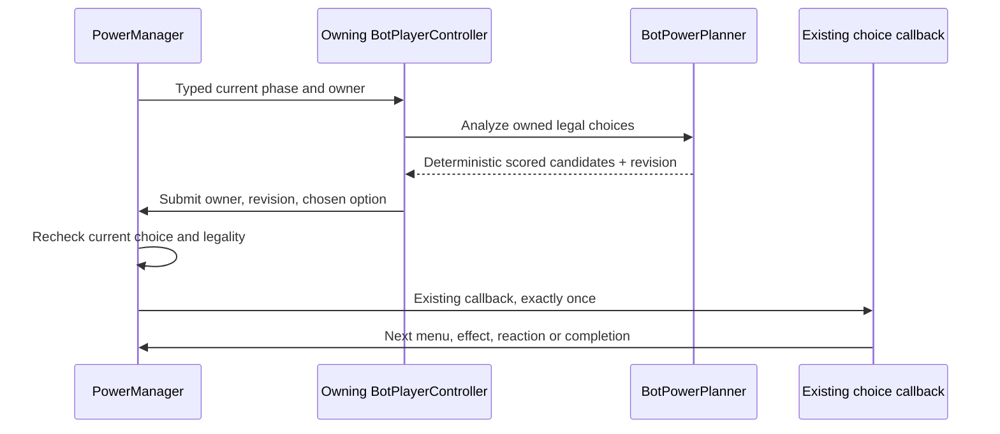

# Heuristic bot: first playable version

In **Playtest Runner > Game Setup**, set each player's control mode after their
name and kingdom. **Bot controlled** players automatically analyze and execute
their own turns and owned power choices once resource setup is complete.
**Player controlled** is the default and never independently automates actions;
a bot that legally acquires Manipulation may control that player's turn.

Open **Tools > Busara > Bot Decisions** to observe any player's latest analysis
and automatic execution history. The runtime scheduler does not require this
window to be open. Both normal Start Game and Fast Test Start preserve the
configured control modes.

- **Analyze only** leaves the game unchanged and lists every considered path,
  its utility score, the individual score contributions and the selected path.
- **Execute chosen path** runs that exact recommendation. If relevant game state
  changed since analysis, execution is rejected: analyze again.
- **Analyze + step** performs both operations once.
- **Bot controlled** changes the selected player's runtime control mode.
- **Pause bot for inspection/manual steps** suspends that bot while you inspect
  or manually execute a decision. Resume to continue automatic play. Each bot
  acts only when it owns the decision (including reactions or a controlled turn). Closing the window
  does **not** stop assigned bots; leaving Play Mode does. Errors pause the bot
  with a visible status and Console warning. Pending human choices make it wait;
  it resumes after those choices are resolved.

Each runtime controller retains its last 20 automatic paths and scores, so opening
the window after a bot has acted still shows its decisions. Manual steps have a
separate window history. The candidate
table retains the most recent analysis, even after that step changes the game.
The score bars are relative to that analysis, not probabilities.

## What this version can play

The runtime evaluator considers pairs of adjacent resources **on its own board**
for forging, moves to adjacent empty spaces **on its own board**, drawing an
unknown card, placing a revealed resource, ending the turn, and all 15 kingdom
powers. Own-turn powers compete with ordinary actions; reaction windows are
evaluated by their actual decision owner, who need not be the active player. It
also handles **Hard Winter**: each affected bot discards one owned virtue,
preferring surplus (-15) over losing victory-goal progress (-100), the inverse
of the existing forge priorities. Ties use virtue type order. Only the bot's own
holdings/goals are scored, including its hidden virtues; no visibility flag changes.
The same discard handler used by the X button removes the token and advances the
special turn. Empty players are skipped by the disaster; humans still choose.
Choices and scores appear in the normal bot trace. Modal choices block submission,
and stale inventory/disaster revisions cannot replay a discard.

It does not implement cross-board moves, cooperative/chained forging, weapon
activation, trade negotiations, or other disaster discard phases. Those remain
human-controlled. Power-created choices, including Celestial Dome's threat
reaction, are supported. During Manipulation, the controller's bot chooses a
legal action on the active player's board, aiming to deny that player's visible
progress; it does not trade or use the controller's resources as payment.

Drawing and placement are separate decisions. After a resource is revealed,
the next step compares its legal empty spaces. Hard Winter's affected bots choose
their own virtue losses automatically; other disasters still wait for normal
human-driven resolution. It does not skip disasters. A bot-owned protection
prompt is scored like any other power reaction.

Execution calls the same action handlers used by the game UI. It does not grant
virtues, move pieces, change the deck or complete reactions using fixture edits.
Consequently normal turn completion, Magic extra actions, protection and
reaction prompts remain in the game's existing lifecycle.
The scheduler never calls an extra end-turn after executing a handler: doing so
would skip the next player or interfere with Magic's remaining actions.

## How the heuristic works

This is a **one-step evaluator with an estimated future-forging value**, not
minimax, reinforcement learning, or an exhaustive search tree. A path means
`candidate action -> estimated immediate outcome -> utility score`. It does not
claim that future players will follow that path.

| Contribution | Utility points |
|---|---:|
| Forge a virtue still missing from the bot's victory goals | +100 |
| Forge a surplus virtue | +15 |
| Spend two resources forging | -16 |
| Complete all of the bot's victory goals | +10,000 |
| Move action cost | -2 |
| Retain a newly placed resource | +8 |
| End turn without board progress | -50 |

For each evaluated board, a forgeable adjacent pair contributes **12** potential
points when it makes a missing goal virtue, or **2** for a surplus virtue. A move,
placement or forge adds the **change** in this potential to its other terms.
Pairs with depleted virtue stock contribute nothing and cannot be selected for
forging. Shared-piece pairs can be counted more than once: this is a cheap
opportunity estimate, not a promise that every pair can be forged.

An unknown draw uses a deliberately fixed prior: **75% resource / 25% disaster**,
with resource types equally likely. Each possible resource branch scores its
best hypothetical placement; the disaster branch has raw utility **-12**.
The table shows each branch, its best space and weighted contribution.
These are **initial tuning assumptions**, not measured deck odds. The evaluator
never inspects the next card or deck order.

The bot uses its own kingdom goals and inventory, its own visible board, legal
adjacency, and aggregate virtue-stock availability. It does not inspect another
player's kingdom or individual virtue holdings, including hidden inventories.
Stock availability comes from the existing game's stock-count helper.

Paths are sorted by descending score, then action kind, source slot and
destination slot for deterministic ties. For example, forging a missing virtue
from an isolated useful pair scores `100 - 16 - 12 = 72`; completing the final
goal adds another `10,000`. A move that creates one useful pair scores
`-2 + 12 = 10`.

## Power decisions and follow-up choices

`PowerDecisionContext` identifies the phase, its owner, the tentative use and
any triggering power. Each option carries a `PowerOption` kind and typed
player/virtue/resource/space data. Text is display-only: changing "Use power" or
translating a title does not change bot behavior.

The runtime controller evaluates one decision per update at most. Ordinary
actions have a one-second cadence; subsequent power choices have a quarter-second
cadence. A human owner, paused bot, or manual **Inspect player** popup is not
automated. Unknown phases/options stop with an actionable diagnostic rather
than clicking the first enabled button. Inspect the owner's **Bot Decisions**
trace for candidates, chosen output value and the estimated benefit/payment loss.

The planner values a goal virtue at 100 and surplus at 15, with the existing
10,000 victory bonus. Payment is valued by the actual multiset lost, not just
its count. Optional uses must have positive estimated benefit after payment;
an own-turn power must also beat available ordinary actions. Cancel/pass is a
real zero-value alternative. Follow-up choices make forward progress toward
the selected use; they do not bypass preparation, exact payment, confirmation,
King's Necklace, resource stock/capacity, or completion callbacks.
Follow-up scores also contain explicit progress priorities (for example,
payment selection uses 1000 minus marginal virtue loss); these are not claims
that a menu click creates 1000 points of game value.

| Kingdom / power | Decision and follow-up policy |
|---|---|
| Egolica / Abundance | Estimate legal added pieces and useful pairs; select resource types and spaces. Hidden-only eligibility prevents a second free use. |
| Konga / Magic | Compare two estimated extra actions against payment and the ordinary action alternative. Spend remaining extra actions rather than recursively buying Magic during them. |
| The Aradas / Identity Surfing | Compare visible victory-goal progress after the swap and the danger of giving the other player a winning kingdom. An unseen target uses a fixed uncertainty-adjusted prior, never its actual hidden goals. |
| Eko Akete / Transform | Keep payment separate; exchange affordable surplus toward a needed receive type, bounded by available stock. Select exchange tokens, receive type, then confirm. |
| ILAGIK / Witchcraft | Estimate a sequence of strictly improving swaps/moves. Each executed rearrangement must improve board potential; Finish at a local optimum. |
| Bis-Bese Avouman / King's Necklace | Evaluate the triggering effect's impact on this bot, not simply whether an opponent cast it. Nested cancellation reverses the underlying effect's value; paid costs stay sunk. |
| Milu / Invisibility | Compare gained placement/pairs, the target's public resource loss and the privacy benefit; choose the resource and destination. |
| Empire Volta / Celestial Dome | Compare estimated threatened loss against payment. Protection still applies only to attacks/disasters, not arbitrary powers. |
| N'evulandis / Infinite Knowledge | Value genuinely unknown information at 35, known information at zero. Choose an unknown target and acknowledge the caster-owned private notice. |
| Royaume Kongo / Manipulation | Compare denying the target's public action opportunity against payment. Route the controlled action through normal handlers using the action owner's board/inventory. |
| Kavango Keendobe / Rain | Compare add/remove counts 1-3 across public boards. Each affected participant owns its resource/type/space choices; human or paused participants still wait. |
| Ubunifu / Imagination | Value the transferred virtue against payment and visible opponent loss. Target only visible holdings; do not guess at hidden virtues or repeat an invalid confirmation. |
| Logone / Blessing of Plenty | Estimate additions from the initial resource multiset, then choose available copy types/spaces until done or capacity/stock is exhausted. |
| Telalila / Time | Compare an estimated extra turn against payment in each legal offer. Use the existing FIFO queue; no synthetic turn completion. |
| Mask of Light / Retraction | Compare only observable before/after state, preserving independent reaction payments in the estimate. Pay/confirm through the manager, acknowledge the notice, and let the original pending action finish once. |

These are heuristic policies, not new game rules or optimal-play guarantees.
Public board effects use the same resource and adjacent-pair values as ordinary
actions. Other players' advantages generally have weight 0.35 relative to the
bot's own. Magic/Time extrapolate from one useful action rather than searching
every future action. Unknown Identity targets use a fixed prior of 60;
information uses 35; unknown-goal forge opportunities use 60. Dome uses a
coarse threat-loss estimate. These constants are explicit tuning assumptions,
not information obtained from hidden cards.

Hidden opponent kingdom goals/virtues are not read for payoff scoring. Snapshot
valuation must also honor what the reactor could see at capture, not just what
it can see now; a changed kingdom is conservatively valued without goal-specific
snapshot information. The undo legality check remains authoritative and separate.
Aggregate stock is public information. Controlled turns use controller-visible
data, and do not run the action owner's autonomous bot over the controller.

Menus carry revisions, and execution re-analyzes before submitting the original
option. Changed decisions, old callbacks and duplicate submissions cannot spend
or complete again. Finite selections end by their actual counts/capacity.
Witchcraft's strictly increasing potential prevents rearrangement cycles; Magic's
extra-action policy avoids self-chaining. Time and Retraction still require real
payments under the existing rules, including payments that survive undo. There
is no arbitrary cap on legitimate resource choices or a new rule limiting power use.

## Source and extension points

- [BotPlanner.cs](../Busara/Assets/Busara/script/Core/BotPlanner.cs): pure snapshot
  scoring; no Unity scene mutation or deck access.
- [HeuristicBot.cs](../Busara/Assets/Busara/script/Core/HeuristicBot.cs): captures
  live inputs, guards game phases, rejects stale decisions and calls game actions.
- [BusaraBotWindow.cs](../Busara/Assets/Busara/script/Editor/BusaraBotWindow.cs):
  candidate paths, score breakdowns, execution history and opt-in automation.
- [BotPlayerController.cs](../Busara/Assets/Busara/script/Core/BotPlayerController.cs):
  per-player runtime scheduling, pause/error state and automatic trace history.
  Player setup installs one controller per participant.
- [PowerDecision.cs](../Busara/Assets/Busara/script/Core/PowerDecision.cs):
  typed decision ownership, phases and option payloads.
- [BotPowerPlanner.cs](../Busara/Assets/Busara/script/Core/BotPowerPlanner.cs):
  all-power estimates, privacy-aware utility, follow-up selection and stale-plan checks.
- [BotPlannerTests.cs](../Busara/Assets/Busara/script/Editor/BotPlannerTests.cs):
  deterministic scores, legal targets, stock, chance branches and immutability.
- [BusaraPlaytestToolsTests.cs](../Busara/Assets/Busara/script/Editor/BusaraPlaytestToolsTests.cs):
  real-scene integration scenarios.
- [BotPowerTests.cs](../Busara/Assets/Busara/script/Editor/BotPowerTests.cs):
  all-power policy, typed choices, payment, privacy and replay regressions.
- [BotPowerSceneTests.cs](../Busara/Assets/Busara/script/Editor/BotPowerSceneTests.cs):
  live scheduler, reactions, affected-player choices and completion scenarios.

Extend one action type at a time: define its legal candidate generator, simulate
its outcomes without mutating the board, provide named score terms, and route
execution through the corresponding normal action handler. Add focused scoring
and live-action cases before enabling it in automation. Runtime scoring and
execution and automatic scheduling do not depend on UnityEditor. The current
assignment and diagnostics interface is in the Editor; the runtime setup entry
also carries control mode for a future in-game assignment interface.

When adding a power, extend `Supports`, its plan and stakeholder estimates, and
any new phase policy. Annotate every menu and notice with an intentional owner,
including recursive callbacks and nested reactions. An unknown option should
remain a visible diagnostic until its behavior is implemented; never hide the
gap by auto-passing or matching a UI label. Include a useful paid activation,
a declined activation, privacy, stale submission and completion regression.
