# Busara kingdom powers: a junior Unity developer's guide

This is a guided reading of the **implemented game**, not a proposal for a new system. It explains how kingdom assets become player choices, how a power is paid for and resolved, and why reactions and undo need more than a button calling an effect.

**Audience:** you can read a C# class, attach a component in Unity, and wire a Button's `onClick`, but may be new to ScriptableObjects, callbacks, and state machines. Read with the source open. Method names in backticks are real unless explicitly described as pseudocode.

**Scope and evidence:** the restored runtime, assets, and existing EditMode tests in this worktree. Game-rule descriptions are paraphrases; implementation constraints are called out separately. This guide does not change the rules or runtime. The local Unity MCP is a development tool, not part of the gameplay architecture; its separate [README](../tools/unity-mcp/README.md) explains its use.

## Contents

- [1. Learning path and vocabulary](#learning-path)
- [2. Data, live objects, and per-use context](#architecture)
- [3. Asset wiring and the catalog](#asset-wiring)
- [4. Menu, player setup, and the first resource turns](#player-setup)
- [5. The activation transaction](#activation)
- [6. Choice UI, callbacks, and input locks](#choices)
- [7. Resources, stock, and partial effects](#resources)
- [8. Reaction windows and turn control](#reactions)
- [9. Snapshots, Retraction, and information](#snapshots)
- [10. All fifteen kingdom walkthroughs](#kingdoms)
- [11. Adding a power safely](#adding-a-power)
- [12. Debugging and testing](#debugging)
- [13. Source map and implementation boundaries](#source-map)

<a id="learning-path"></a>
## 1. Learning path and vocabulary

Read sections 2-5 first, then **Abundance** for a small asynchronous effect, **Identity Surfing** for reference swapping, **Magic/Time** for the difference between actions and turns, and finally **Retraction**. Return to the source map whenever you meet an unfamiliar class.

| Term | Meaning in this implementation |
| --- | --- |
| Kingdom | Shared definition of a kingdom's name, story, power, and victory requirements. |
| Power asset | Shared `ScriptableObject` defining a power's cost, timing, description, and `Execute(PowerUse)` behavior. |
| Caster | `PowerUse.Caster`: the player who activates and pays for this particular use. |
| Target | `PowerUse.Target`: another player selected or supplied by a reaction window. Not every power needs one. |
| Active player | `TurnManager.ActivePlayer`: whose resources/action/turn are being processed. A reacting caster can be someone else. |
| Controller | Optional `PowerManager.Controller`: the player choosing the active player's action after Manipulation. Does not replace `ActivePlayer`. |
| Viewer | Controller if present, otherwise active player; used by privacy-aware displays. |
| Virtue | A reference to a `Virtue` definition in `Player.Virtues`. Repeated references represent multiple tokens. |
| Resource | A live `Resource` component occupying a `Slot`, with a resource type and a back-reference to that slot. |
| Preparation | Selecting payment/target/options, before ownership is changed. Cancellation is still allowed. |
| Commit | Removing the exact payment and revealing the caster's kingdom. This happens before King's Necklace can cancel the effect. |
| Continuation | A C# `Action` callback saying what to do *after* a choice/effect finishes. It is not a new thread. |
| Reaction | A paid use offered by the manager at a particular boundary, not an unrestricted interrupt. |
| Snapshot | An in-memory copy of selected game state before an action; not a saved scene or universal Undo record. |
| Multiset | A collection where duplicates matter. `[Air, Air, Water]` is different from `[Air, Water]`. |
| Best effort | Apply as many resource additions/removals as are currently possible; explain why the remainder is skipped. |

**Read code like a timeline.** `PowerEffects.AddResources(player, 3, use.Complete)` does not mean all three pieces appear immediately. It builds a menu, returns, and continues when a human presses a button. `use.Complete()` is the finish line; returning from `Execute` is not.

<a id="architecture"></a>
## 2. Data, live objects, and per-use context

### 2.1 Three different lifetimes

| Kind | Examples | Where it lives | What belongs there |
| --- | --- | --- | --- |
| Shared definition | `Kingdom`, `Power`, `KingdomCatalog`, `Virtue` | `.asset` files | Names, costs, victory goals, references, stateless effect behavior. |
| Live scene component | `Player`, `Board`, `Slot`, `PowerManager`, `TurnManager`, `PowerUIManager` | GameObjects in the running scene | Ownership, occupied spaces, current turn, menus, remaining actions, queued turns. |
| Per-operation C# object | `PowerUse`, `PowerChoice`, `TurnSnapshot` | Managed memory | One activation's selections/callback, one choice, or one historical copy. |

A `MonoBehaviour` participates in Unity lifecycle messages such as `Start`/`OnEnable` and can refer to its `gameObject`/`transform`. A `ScriptableObject` is an asset object, not a component on the player's GameObject. Several players or test fixtures can refer to the same asset.

The assets are **treated as immutable during play**, not made immutable by C# access modifiers: their fields are public and editable in the Inspector. Do not store a selected target, payment, or remaining resource count on a power asset. A second activation or nested reaction would overwrite the first activation's state; Editor asset dirtiness could also leak out of Play Mode.

`PowerUse` solves that lifetime problem. It holds `Caster`, `Power`, `Target`, `ChosenVirtue`, the readonly **list references** `Payment`/`Exchange` (their contents are mutable), `ResourceCount`, `RemoveResources`, and `Complete`. Each `Prepare` allocates a new context. `PowerManager` still owns the overall transaction and reaction state; the context is not a replacement manager.

### 2.2 UML class diagram: ownership and collaboration

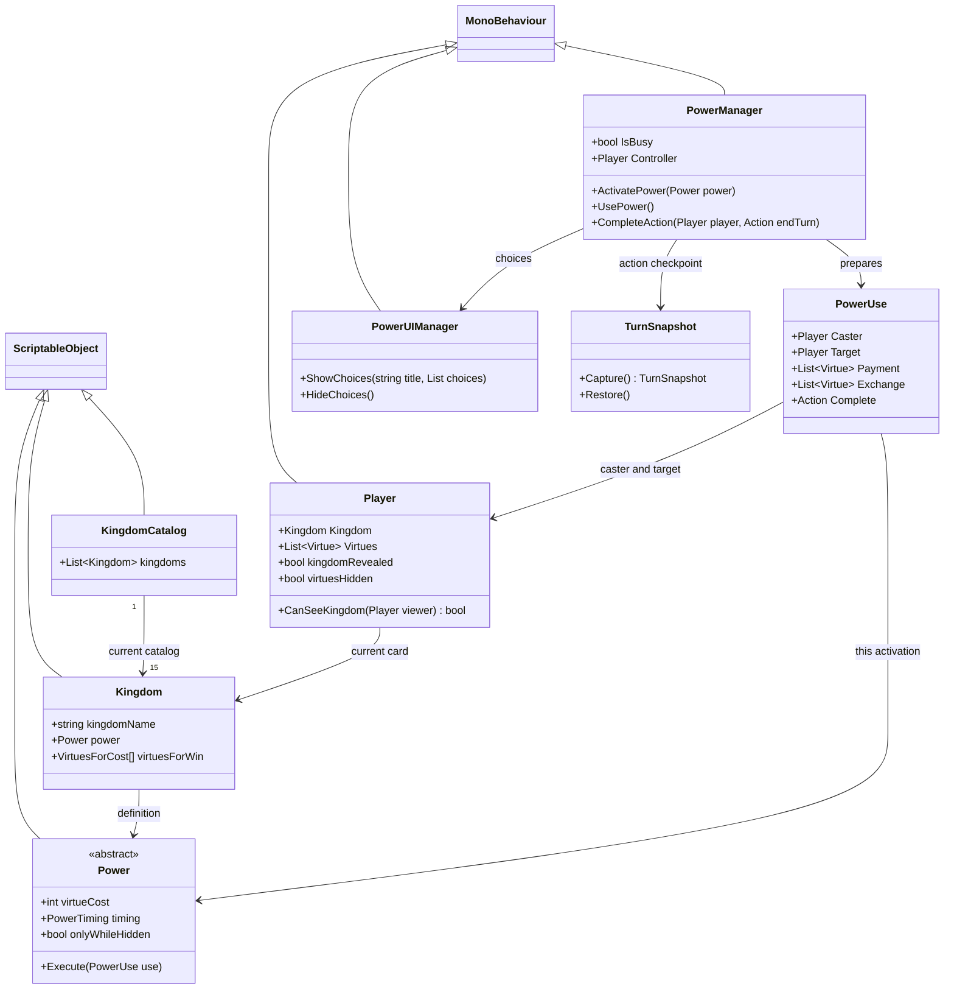

*Figure 1. UML class diagram, simplified to teaching-relevant members. Arrows mean references/dependencies, not ownership of Unity asset lifetimes. The catalog's 15 is the current data count, not a hardcoded list-size constraint in `KingdomCatalog`.*

There is no event-sourcing framework, dependency-injection container, networking authority, or general ability engine here. Singleton-style `Manager<T>.Instance` references connect the scene systems. The shared `Power` base provides polymorphic execution, but `PowerManager.Configure`, `Validate`, and reaction discovery still contain concrete `is SomePower` checks. A new subclass alone does **not** automatically gain target menus or a reaction window.

<a id="asset-wiring"></a>
## 3. Asset wiring and the catalog

Start with [KingdomCatalog.cs](../Busara/Assets/Busara/script/Core/KingdomCatalog.cs) and its [catalog asset](../Busara/Assets/Busara/ScriptableObjects/Kingdoms/KingdomCatalog.asset).

Follow the references in Unity:

1. Open [GameScene](../Busara/Assets/Scenes/GameScene.unity) and locate `PlayerManager`.
2. Its `kingdomCatalog` points to the catalog asset. The scene has `requirePlayerSetup: 1` and `dealKingdomsFromCatalog: 0`.
3. Each catalog entry is a `Kingdom` asset. `Kingdom.power` points to one `Power` asset.
4. The power asset's `m_Script` refers to the concrete power script's `.meta` GUID. Its serialized `virtueCost`, `timing`, and `onlyWhileHidden` supply configuration.
5. Kingdom victory entries reference `Virtue` assets and counts, independently of the power's activation cost.

**Why filenames are not enough.** Unity serializes references with `fileID`, `guid`, and `type`. The catalog's asset GUID is `bc030000000000000000000000000008`; its script GUID is `bc010000000000000000000000000008`. Those are different objects. A scene reference to the catalog uses asset `fileID: 11400000`; an asset's script reference uses `fileID: 11500000`. Read these to diagnose a missing reference, not as values to invent for new assets.

The restored new effect scripts use the GUID suffixes `...001` through `...007` under `bc01000000000000000000000000000` for Abundance, Magic, KingsNecklace, CelestialDome, Rain, TimePower, and Retraction respectively. Prefer moving/renaming assets in Unity so their `.meta` files move with them.

Two historical script names were corrected while preserving their original `.meta` GUIDs: `Identity Surfing.cs` became `IdentitySurfing.cs`, and `InfiniteKnowladge.cs` became `InfiniteKnowledge.cs`. Existing **asset** filenames can still contain old spellings. Do not rename those blindly or assume a C# class and an asset have identical names. The per-kingdom source links below deliberately use the actual filenames.

Serialized timing enum values in [Power.cs](../Busara/Assets/Busara/script/Core/Power.cs) are:

| Serialized integer | Enum | Actual entry point |
| --- | --- | --- |
| 0 | `OwnTurn` | Active player's power button, when the ordinary action is available. |
| 1 | `TurnStart` | `BeginNormalTurn` offers Manipulation to other players. |
| 2 | `OtherTurn` | Time is offered before another player's action and after it. Retraction is offered after it. |
| 3 | `PowerReaction` | `RunCommitted` offers King's Necklace after a power is paid for. |
| 4 | `ThreatReaction` | `OfferProtection` offers Celestial Dome from weapon/disaster code. |

The enum is data, not a scheduler. The manager's concrete type filters determine which reaction is offered. Changing only an Inspector timing number cannot turn any arbitrary subclass into a functioning reaction.

<a id="player-setup"></a>
## 4. Menu, player setup, and the first resource turns

Player setup does **not** randomize a kingdom after the user selects it. It uses the full catalog to validate and assign exact asset references.

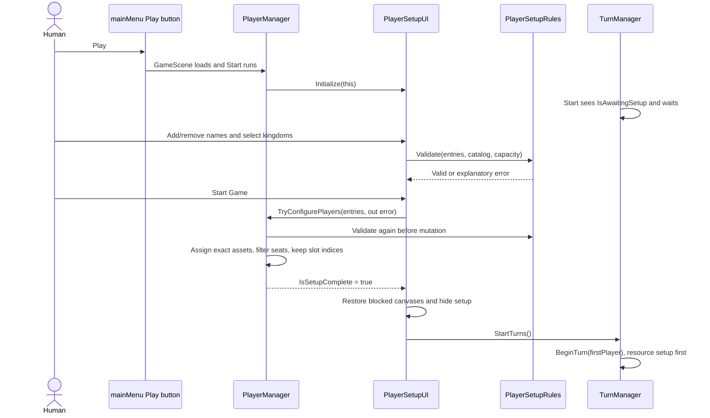

*Figure 2. UML sequence diagram of successful setup. Invalid input stops before assignment; it does not start a partial match.*

[PlayerSetupRules](../Busara/Assets/Busara/script/Core/PlayerSetupEntry.cs) enforces at least two players, actual configured-seat capacity, trimmed names of 1-32 characters, case-insensitive unique names, distinct selected kingdoms, and a complete non-null catalog. The default two rows start with no kingdom selected.

The authored scene has **four** boards, so the UI promises **2-4**, not the broader rules' 2-6. A supported seat requires a `Player`, `Board`, and `setUpCard`; final configuration also checks registered distinct boards and usable slots. Disabling seats must not slide remaining boards into different global coordinates: `TryConfigurePlayers` inserts invisible grid placeholders, keeps original `Slot.Index` values, filters `BoardManager.gameBoards`/`slots`, hides unused player UI, and unregisters unused board turn listeners.

Configuration alone does not start turns. `PlayerSetupUI.StartGame` restores canvas interaction, hides its opaque setup canvas, clears UI selection, and then calls `StartTurns`. Existing `setUpCard` assignments and `hasFinishedSettingUp` state remain intact. `TurnManager.BeginTurn` opens normal-turn reactions only when setup is finished and the turn is not a special-card phase.

`StartTurns` is gated and idempotent. `TryConfigurePlayers` rejects later reconfiguration, and `DealKingdoms` refuses to redeal after setup. Existing board save/load now checks the selected boards' total slot count rather than demanding four boards' worth of data; this is not a full match-save system.

**Tests to read:** [PlayerSetupTests](../Busara/Assets/Busara/script/Editor/PlayerSetupTests.cs), especially `SetupFiltersSeatsWithoutChangingSlotsOrResourceCards`, `StartIsGatedUntilValidSetupAndCannotRestartOrRedeal`, and `ResourceSaveLoadUsesConfiguredBoardCount`; then [PlayerSetupSceneTests](../Busara/Assets/Busara/script/Editor/PlayerSetupSceneTests.cs), `MenuPlayRequiresSetupBeforeResourceTurns`, which drives the actual menu and dropdown UI.

<a id="activation"></a>
## 5. The activation transaction

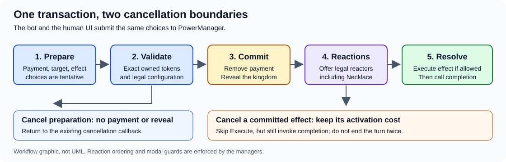

*Figure 3. Offline transaction graphic. The red boundary is the point after which preparation cannot be cancelled. King's Necklace cancels an effect, not the already-committed cost.*

### 5.1 Follow one button through the code

The ordinary UI entry is [PowerActionMove.OnTapPower](../Busara/Assets/Busara/script/Actions/PowerActionMove.cs). It gets the active player's kingdom power and calls `PowerManager.ActivatePower`. The no-argument `Power.Execute()` remains as a legacy UnityEvent adapter to that manager; the effect override `Execute(PowerUse)` is not the public UI payment path.

`ActivatePower` rejects a busy manager, a special-card phase, insufficient virtues, a hidden-only power whose kingdom is revealed, a different asset from the player's current power, non-`OwnTurn` timing, or an unavailable normal action. A rejected button may show a notice; reaction powers are offered automatically instead.

`Prepare` creates `PowerUse`, records the completion/cancellation continuations, raises `OnPowerActivated`, and opens `PaymentMenu`. These are tentative selections. Selecting a token here **does not remove it**.

The payment menu groups actual owned `Virtue` references with `Distinct`, offers plus/minus choices up to the required cost, and enables Continue only if `PowerRules.CanPay` passes. The helper copies the owned list, removes each selected reference once, and requires `selected.Count == cost`. Two selected copies need two owned copies; a fake same-type ScriptableObject is not the same owned token definition.

After payment selection, `Configure` supplies targets and options. Identity Surfing, Infinite Knowledge, Imagination, and Invisibility get another-player selection. Transform has a separate exchange menu; Rain chooses a common add/remove count. Other powers go directly to confirmation. Imagination's virtue menu lists `ForgeManager.AllVirtues`, not only the target's virtues, so final validation can reject a chosen type the target lacks.

`Confirm` shows Use/Back/Cancel. `UsePower` **validates again**; a button being enabled earlier is not authoritative. Invalid options return to a payment notice/menu without charging. Valid options commit in this order:

1. Clear the global prepared-use/cancel continuation so this use cannot be cancelled as preparation.
2. Remove every selected payment token from the caster.
3. Record non-own-turn payment in `reactionPayments` if an action snapshot exists.
4. Set the caster's `kingdomRevealed = true`, clear legacy virtue selection, and notify state/deactivation listeners.
5. Call `RunCommitted`, which may resolve King's Necklace reactions before calling the actual effect.

This is a transaction boundary implemented with explicit state, not an ACID database transaction. Do not describe it as automatic rollback of arbitrary exceptions.

### 5.2 UML sequence diagram: successful effect or paid cancellation

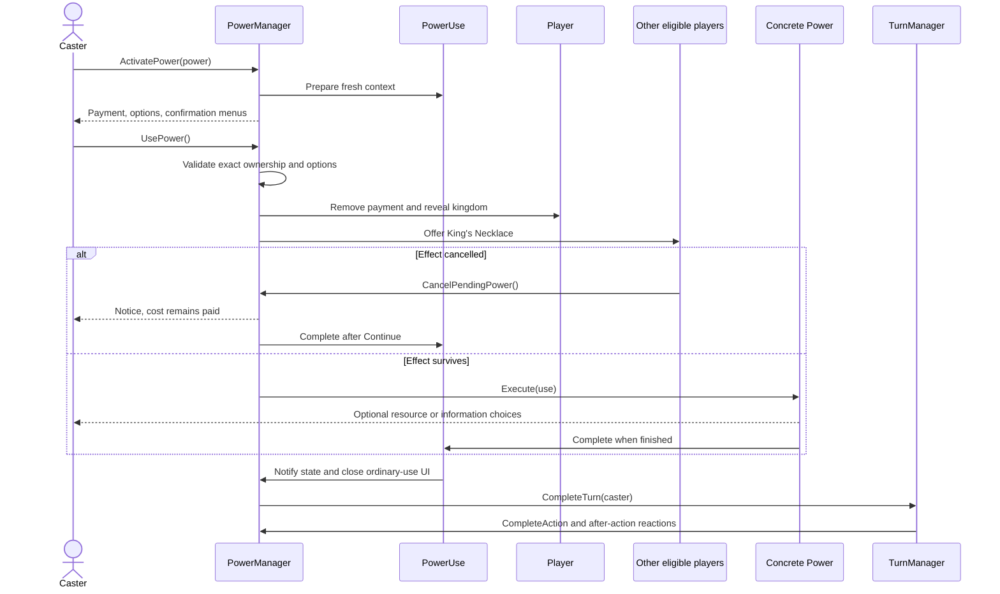

*Figure 4. UML sequence diagram for an own-turn power. A reaction use's `Complete` instead advances its enclosing offer list; it must not end the reacting player's unrelated turn.*

### 5.3 State diagram: preparation is not resolution

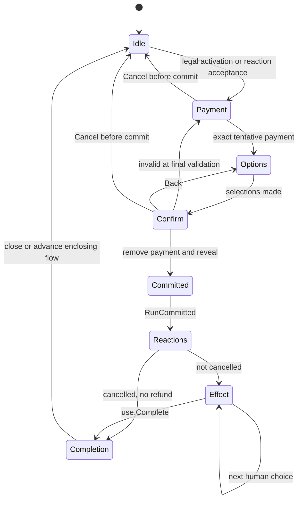

*Figure 5. Conceptual state diagram. These labels summarize control flow; the code does not define a `PowerState` enum with these values. A nested reaction can itself run another instance of this lifecycle.*

`OnPowerDeactivated` fires at commit or preparation cancellation. It does **not** mean an asynchronous effect is finished. `OnStateChanged` fires at commit and via `PowerUse.Complete`; stateful UI listeners refresh from the real player data.

<a id="choices"></a>
## 6. Choice UI, callbacks, and input locks

### 6.1 A callback is a continuation, not a stored answer

`PowerChoice` contains a label, an `Action OnSelected`, and an enabled flag. `PowerManager.Choose` publishes choices and sets `IsBusy`; `PowerUIManager.ShowChoices` renders them as runtime uGUI Buttons with TMP labels.

For example, `ChooseEmptySlot(player, slot => { ... })` creates one button per eligible slot. The lambda captures the chosen `Slot` and the remaining effect work. It is invoked only after a click. The caller must not also complete the action immediately after opening that menu.

There are two stale-input defenses:

| Layer | Guard | Why it exists |
| --- | --- | --- |
| Manager | `menuVersion` captured by each wrapped choice, incremented on selection/replacement/close | A retained old callback cannot spend or apply again after the menu changes. Disabled choices are rejected. |
| UI | `choicesRevision`, `selectingChoice`, enabled/visible checks | Prevent reentrant or double-click invocation while the callback rebuilds/destroys its own buttons. |

`ClearChoiceButtons` removes listeners, deactivates old objects, then schedules `Destroy`. Deactivation matters because Unity destroys objects at the end of the frame. `HideChoices` increments revision even if no canvas is visible. Button execution uses `try/finally` to release the reentrancy guard, not to swallow errors.

The choice canvas is built lazily, sorted above existing canvases, and uses scrollable title and button regions. TMP labels in this generic overlay have rich text disabled. No third-party UI package was added for choices.

### 6.2 Input safety also belongs below the UI

The panel does not cover every screen pixel, so a modal-looking canvas alone is insufficient. The runtime checks `PowerManager.IsBusy` in normal-action availability, resource/slot selection, resource-discard clicks, trade completion/cancellation paths, and normal/special turn completion.

In particular, [Resource.OnclickDestroy](../Busara/Assets/Busara/script/Core/Resource.cs) must not discard a piece behind a pending reaction. [TurnManager.CompleteSpecialTurn](../Busara/Assets/Busara/script/Managers/TurnManager.cs) must not advance the affected-player list while a modal choice is unresolved. These are logic protections, not just visual disabling.

These guards are **not** a server-side permission system. A local shared-screen game still relies on the person named in the prompt to make their own choices. The current UI does not authenticate which human clicked a Rain or reaction option.

<a id="resources"></a>
### 6.3 Bots use the same menus, not a second power implementation

[PowerDecisionContext](../Busara/Assets/Busara/script/Core/PowerDecision.cs) supplies
an explicit decision owner, phase and typed use/target/resource context.
`PowerChoice.Option` describes what each option means; the button label remains
presentation text. The bot must not infer a payment or a target by parsing that
label.

This distinction is essential for reactions. In the "Player 2's action has
resolved; Player 1: Retraction" window, Player 1 owns the decision even though
Player 2 is still `ActivePlayer`. For Rain, ownership moves to each affected
participant. During Manipulation, the controller chooses the active player's
normal action without substituting its own inventory or reading hidden goals.

The runtime [BotPlayerController](../Busara/Assets/Busara/script/Core/BotPlayerController.cs)
asks [BotPowerPlanner](../Busara/Assets/Busara/script/Core/BotPowerPlanner.cs) for
scored candidates, then submits the selected option through the manager's
owner/revision guard. Existing preparation, exact payment, nested Necklace,
effect callbacks and turn completion still do the work. The scheduler does
not issue an extra `CompleteTurn` after a power callback.

All 15 powers have an explicit policy, including payment, target, exchange,
resource, space, information, confirmation and finish choices. See the
[per-kingdom bot policy matrix](heuristic-bot.md#power-decisions-and-follow-up-choices)
for the complete mapping and scoring assumptions. A bot can choose Use or Pass
based on estimated benefit versus owned-virtue cost; support does not mean
always activating a power.

Human decisions, paused bots and manual inspection windows remain manual.
Unknown typed workflows produce a diagnostic instead of a guessed click.
Retraction scoring receives only state observable to the reactor at capture
and now, whereas the authoritative undo validator can still check actual
ownership. Strictly improving Witchcraft steps end at a local optimum; Magic
uses its granted actions rather than repeatedly buying more Magic inside them.
These are bot policies, not additional game-rule restrictions.

## 7. Resources, stock, and partial effects

### 7.1 Board invariants

Treat these as one relationship:

```text
slot.isOccupied == true
slot.resource == the piece
piece.slot == slot
piece.transform.parent == slot.transform
```

[Board.MoveResource](../Busara/Assets/Busara/script/Core/Board.cs) empties the old slot, occupies the new one, reparents the existing GameObject, centers it, and unhighlights it. It does not create a stockpile resource. `Board.PlaceResource` assigns both directions for a newly spawned or already detached piece.

Use [PowerEffects.SwapOrMove](../Busara/Assets/Busara/script/PowerEffect/PowerEffects.cs) for a Witchcraft destination that may already be occupied: detach both resources before placing them into each other's slots. Calling a simple move over an occupied destination would leave inconsistent references.

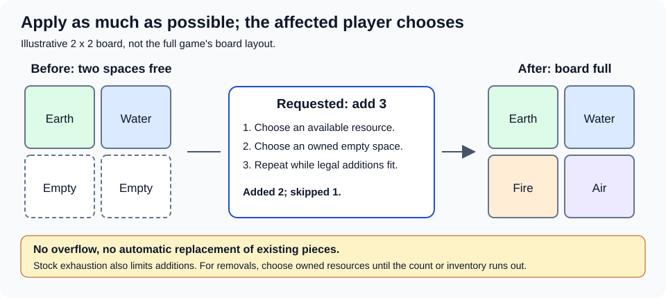

*Figure 6. Offline capacity example, deliberately a small teaching board rather than a screenshot of the authored scene. Actual slot numbers are global `Slot.Index` values displayed to users as index plus one.*

### 7.2 The explicit best-effort policy

For **resource** additions/removals, the user selected this rule: apply as much as possible, and let the affected player choose resources/spaces. Do not replace it with all-or-nothing validation or silent random placement.

`PowerEffects.AddResources(player, count, complete, copies)`:

1. If `count == 0`, invoke the continuation.
2. Build resource-type choices from the enum, or from the distinct types still present in `copies`.
3. Remove types whose `PowerRules.ResourceStock` is zero.
4. If there are no empty slots or legal types, show an explanatory `Notice` and complete after Continue.
5. Ask for a resource type, then ask for an empty space on **that player's board**.
6. Spawn through `BoardManager.SpawnByResourceType`, place through `Board.PlaceResource`, remove one chosen occurrence from `copies` if present, and recurse with one fewer addition.

`RemoveResources` similarly asks for one concrete existing piece, empties its slot, deactivates/destroys its GameObject, and repeats. If none remain, it shows a notice and completes. It never removes virtues instead.

**Stock is derived, not stored in a stockpile object:** `ResourceStock(type)` is 20 minus that type's pieces on participating players' boards, clamped at zero. `VirtueStock(virtue)` is 12 minus all participating players' virtues of that type, also clamped at zero. Returning/spending tokens makes them available through recounting. A move/steal/swap changes location, not total stock usage.

The resource helpers recalculate options between placements. They do not reserve a batch or choose which player gets scarce stock simultaneously. Rain resolves players in `PlayerManager.Players` order, so earlier players can exhaust a type.

**Do not generalize partial success to every power.** Transform validates its exact virtue exchange and stock before commit; it does not partially exchange virtues. Invisibility requires at least one target resource and one caster space. Ordinary drawing/forging has its own code paths; this helper's behavior is not a claim that every game operation uses it.

<a id="reactions"></a>
## 8. Reaction windows and turn control

### 8.1 Actual order, not an invented priority system

`Offer` walks a supplied `List<Player>` by index. Each eligible player gets Use or Pass. It rechecks eligibility before the offer, and the use is validated again on commit. There is no simultaneous bidding, timed response, or universal last-in-first-out reaction stack.

| Boundary | Who is considered | Important behavior |
| --- | --- | --- |
| `BeginNormalTurn(active)` | Other players with Manipulation or Time | Resolve in participating-player list order, then capture the action snapshot and clear reaction-payment history. |
| `RunCommitted(use)` | Other eligible King's Necklace holders | Payment/reveal already occurred. A cancellation stops subsequent eligible cancellations for this pending effect. |
| `CompleteAction(active, endTurn)` | Other players with Retraction or Time | The action has resolved but the turn has not ended. Retraction is limited to one successful undo per action. |
| `OfferProtection(defender, ...)` | That defender if they have Celestial Dome | Called only at integrated attack/disaster sites; does not filter hostile power effects. |

Normal reactions start only after initial resource setup, not for each special affected-player subturn. Time's `OtherTurn` is implemented at **two discrete windows**, not at every instruction of another player's turn.

### 8.2 Nested King's Necklace

Every committed power, including a reaction, passes through `RunCommitted`. A King's Necklace activation can therefore itself encounter another eligible King's Necklace in a deliberately constructed duplicate-kingdom fixture. The manager saves/restores the outer `cancelledPower` flag around each nested committed use. This is scoped cancellation state, not a refund.

The standard setup prohibits duplicate kingdom choices, so most nested duplicate-Necklace cases are defensive/test scenarios. The manager still excludes the current caster and checks available payment for every use. There is no broad once-per-game flag for paid powers.

### 8.3 Magic: two extra actions, not two turns

`GrantTwoActions` adds two to `additionalActions`. At the completion of the Magic activation itself, `CompleteAction` decrements the counter and resets action/selection/draw state instead of ending the turn. That opens the first additional action. After that action, it decrements again and opens the second. After the second, the counter is zero and the turn ends.

The displayed remaining count is `additionalActions + 1` after decrement. This explains why the code can hold `1` while saying that two actions remain: the just-opened action is not counted in the stored future-action counter.

No `PowerManager.BeginNormalTurn` occurs between those actions. Controller state persists through the same turn; each extra-action boundary gets a new snapshot and its own after-action reaction window. The code does not restrict extra actions to non-powers; another paid Magic can add more if otherwise legal. Retraction sets the counter to zero and prevents further extra actions for the undone action.

### 8.4 Time: FIFO extra turns with a remembered return point

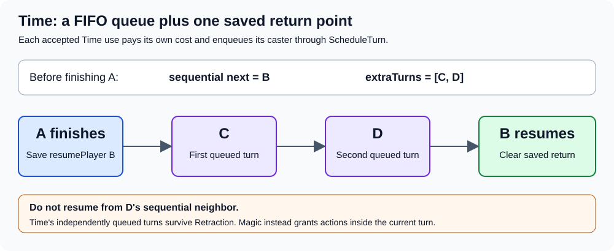

*Figure 7. Offline scheduling graphic. Multiple Time owners are useful for understanding defensive tests, though normal unique-kingdom setup usually supplies one.*

`ScheduleTurn` enqueues a `Player`. `NextPlayer(sequentialNext)` stores the first normal resume player, dequeues all queued extras one at a time, and finally returns the stored resume player. It does not lose the original sequence by continuing from the extra player's neighbor.

Because these are real turns, their setup-finished normal-turn windows and turn listeners run. A Time queue can grow during extra turns if valid reactions enqueue more. It is not snapshot-restored, so undoing another player's action does not cancel a separately paid Time commitment.

### 8.5 Manipulation and protection are different kinds of control

Manipulation sets `Controller`, not `ActivePlayer`. Choices affect the active player's board/inventory; payment for the reaction came from the controller. `Viewer` follows the controller, preserving the distinction between whose turn it is and who can see which private data. Both the trade action entry and `TradeManager.OfferTrade` reject controlled-turn trading.

Celestial Dome sets `cancelledThreat` only inside `OfferProtection`. Weapon code spends the attacker's three weapon resources first, then offers protection to each target; protected defenders are removed from the discard list. The attacker is not refunded.

For disasters, `DisasterManager.TriggerDisaster` offers protection to **the player who drew the card** before `ExecuteDisaster`. If that drawer prevents it, `EndDisaster` runs without executing the disaster at all. This is not a per-affected-player immunity pass after the disaster's targets are calculated.

Resource/Corruption disasters and [Hard Winter](../Busara/Assets/Busara/script/DisasterEffects/HardWinterDisaster.cs) pass `EndDisaster` through the special-turn completion callback. The final affected player must finish discarding before the original draw action completes. Hard Winter opens the player-info panel and lets each player with virtues choose one owned virtue using its X button; it does not automatically remove the first virtue. Only the current discard owner's nonzero virtues have enabled buttons, and direct turn completion cannot skip the choice. Hidden-virtue counts remain private to that discard owner. This is why input guards and the preserved completion callback are part of power correctness.

<a id="snapshots"></a>
## 9. Snapshots, Retraction, and information

### 9.1 What is captured, and what intentionally survives

| State | `TurnSnapshot` treatment |
| --- | --- |
| Each player's kingdom reference | Copied and restored. |
| Each player's virtue list | Copied as a new list of the same virtue references, then restored. |
| Each player's board contents | Stored as a string in board-slot order, then reconstructed as resource GameObjects. |
| `virtuesHidden` | Copied/restored; undoing the action that enabled it can undo that action's hiding. |
| `kingdomRevealed` | Captured, but restoration also preserves kingdom cards revealed since capture. |
| Deck cards and `CardCount` | List/count copied/restored when `DeckManager` exists. |
| Selections / `hasDrawnResource` | Selections cleared; draw flag reset to false during restoration. |
| `knownKingdoms` | Not captured/restored. Information already learned stays known. |
| Extra-turn queue / resume player | Not captured/restored; independent Time effects survive. |
| Reaction payments | Manager records committed reactions and subtracts them again after restoring inventories. |
| Arbitrary scene/UI/coroutine state | Not captured. This is not general Unity Editor Undo or a replay of every event. |

`Board.GetBoardState` encodes empty as `"0"` and occupied as resource enum value plus one, in `Board.Slots` order. `LoadBoardState` destroys old resources and spawns replacements. Do not retain a `Resource` object reference and expect it to survive Retraction; the logical slot/type is restored, not the original instance identity.

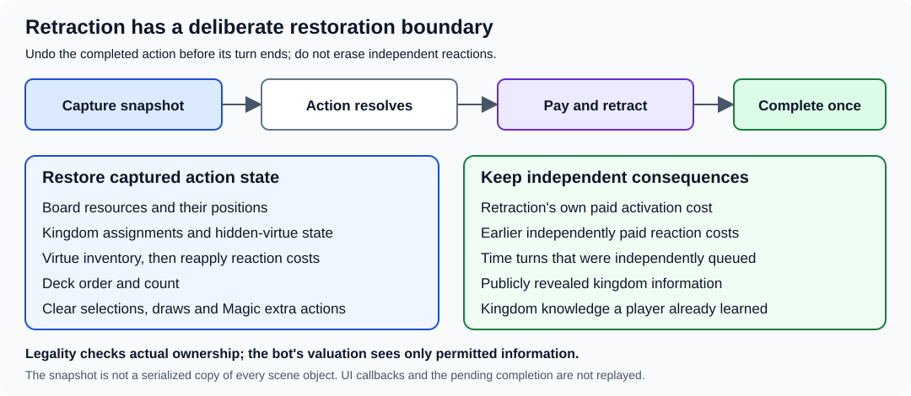

*Figure 8. Offline undo-boundary graphic. The snapshot is smaller than the whole game; preserved commitments live outside its rewind boundary.*

### 9.2 Retraction's payment proof

Suppose B held three virtues at action start. A's action gives B a fourth. B now wants to spend all four across reactions including Retraction. That would appear affordable **now**, but undoing A's action removes the fourth virtue. The undo cannot create an unpaid reaction.

`CanRestorePayments` combines all recorded reaction payments plus the proposed Retraction context, groups them by caster, and checks each combined list against that caster's snapshot inventory with `TurnSnapshot.CanPay`. It does not check only Retraction's cost or only the caster's current inventory.

After a valid Retraction commits and survives Necklace, `Retract` restores the snapshot, subtracts each independent recorded payment again, keeps Retraction's kingdom revealed, cancels additional actions, marks `retracted`, and displays a notice before invoking the reaction continuation.

### 9.3 UML sequence diagram: undo without erasing independent reactions

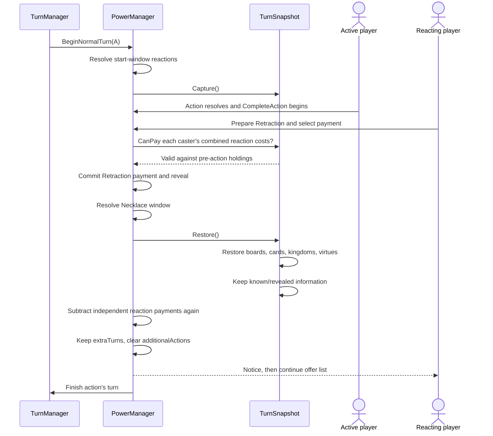

*Figure 9. UML sequence diagram of a successful undo. If payment is invalid or Necklace cancels Retraction, `Restore` is not called.*

### 9.4 Hidden cards, hidden virtues, and winning

`Player.CanSeeKingdom(viewer)` allows the owner, everyone if the card is publicly revealed, or a viewer whose `knownKingdoms` contains that exact Kingdom asset. Knowledge attaches to **cards**, not permanently to their former owners. Identity Surfing moves kingdom references and reveal flags together.

`CanSeeVirtues(viewer)` allows everyone until `virtuesHidden`, then only the owner. Invisibility's flag has no turn-expiry timer. Infinite Knowledge shows the target's **kingdom card** information, not their current virtue inventory; it does not override hidden-virtue visibility. Privacy is implemented in the display/query layer; the lists remain in local memory and are not encrypted.

`TurnSnapshot.Restore` collects the set of currently publicly revealed Kingdom assets before returning cards to their prior owners. A publicly seen card is not made secret again merely because its action is undone. Private knowledge sets are also not erased.

`GameManager.CheckWinConditions` runs from its turn-end listener. It checks the active player first and then every other player, using that player's **current** kingdom's `virtuesForWin` counts. Payment can move someone away from a goal; a kingdom swap can let the other player win. Do not claim victory is checked immediately after every menu click. After-action reactions resolve before the normal turn-end check; Magic extra actions defer that normal end.

<a id="kingdoms"></a>
## 10. All fifteen kingdom walkthroughs

The walkthroughs below share the payment/reaction/completion pipeline in Figures 3-5. Their individual diagrams start **after final commit and any King's Necklace response**, unless explicitly shown otherwise. They are labeled as activity/data-flow sketches, not falsely presented as extra C# state machines.

All uses reveal the caster's kingdom at commit. Only the powers whose assets set `onlyWhileHidden` require the kingdom to be hidden first. Costs are paid in any exact owned combination unless the walkthrough describes additional exchange selections. Victory goals belong to the kingdom card, not to the cost.

| Kingdom walkthrough | Power | Cost | Timing | Victory holdings |
| --- | --- | --- | --- | --- |
| [Egolica](#egolica) | Abundance | 0 | Own turn, hidden only | Security 2, Nature 3, Economy 4 |
| [Konga](#konga) | Magic | 2 | Own turn | Art 3, Security 4, Nature 2 |
| [The Aradas](#aradas) | Identity Surfing | 3 | Own turn | Art 2, Wisdom 3, Nature 4 |
| [Eko Akete](#eko-akete) | Transform | 4 | Own turn | Art 4, Wisdom 3, Economy 2 |
| [ILAGIK](#ilagik) | Witchcraft | 3 | Own turn | Energy 4, Security 3, Nature 2 |
| [Bis-Bese Avouman](#bis-bese-avouman) | King's Necklace | 3 | Power reaction | Art 2, Nature 4, Economy 3 |
| [Milu](#milu) | Invisibility | 2 | Own turn | Energy 2, Nature 3, Economy 4 |
| [Empire Volta](#empire-volta) | Celestial Dome | 1 | Threat reaction | Energy 3, Security 4, Wisdom 2 |
| [N'evulandis](#nevulandis) | Infinite Knowledge | 1 | Own turn | Energy 4, Wisdom 2, Economy 3 |
| [Royaume Kongo](#royaume-kongo) | Manipulation | 3 | Another player's turn start | Art 4, Energy 2, Security 3 |
| [Kavango Keendobe](#kavango-keendobe) | Rain | 3 | Own turn | Security 2, Wisdom 3, Economy 4 |
| [Ubunifu](#ubunifu) | Imagination | 3 | Own turn | Art 2, Energy 3, Wisdom 4 |
| [Logone](#logone) | Blessing of Plenty | 4 | Own turn | Wisdom 3, Nature 4, Economy 2 |
| [Telalila](#telalila) | Time | 2 | Before/after another player's action | Art 4, Energy 3, Nature 2 |
| [Mask of Light](#mask-of-light) | Retraction | 2 | After another player's action | Art 3, Security 4, Economy 2 |

The [catalog mapping test](../Busara/Assets/Busara/script/Editor/KingdomPowerTests.cs), `CatalogKingdomHasExpectedPowerCostTimingAndVictoryGoals`, is the executable reference for this table. Goal counts are minimum holdings, not exactly-equal checks. Paying for a power consumes virtues that might otherwise satisfy the goal.

<a id="egolica"></a>
### 10.1 Egolica: Abundance

**Source chain:** [Egolica.asset](../Busara/Assets/Busara/ScriptableObjects/Kingdoms/Egolica.asset) -> [Abundance.asset](../Busara/Assets/Busara/ScriptableObjects/Kingdoms/PowerObjects/Abundance.asset) -> [Abundance.cs](../Busara/Assets/Busara/script/PowerEffect/Abundance.cs).

**Player-facing rule:** while this kingdom card is still hidden, take as many resources as there are participating players. Cost is **zero virtues**, but this is still an own-turn power use, not an automatically triggered bonus. Commit reveals the card, making its hidden-only gate fail on later attempts.

**Implementation walkthrough:** `ActivatePower` checks `onlyWhileHidden`; the payment menu still requires an exact empty payment. `Abundance.Execute(use)` calls `AddResources(use.Caster, PlayerManager.Instance.Players.Count, use.Complete)`. Using the filtered participant list matters: a two-player setup does not grant four resources merely because four boards were authored.

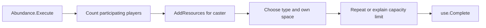

*Activity sketch A. Expands the effect box in Figure 4; exact resource-loop details are in section 7.*

**Worked example:** with three configured players, hidden Egolica, three empty spaces, and sufficient stock, choose Air/space 1, Water/space 2, and Earth/space 3. Three pieces appear; no virtues are removed; Egolica is publicly revealed. With only one empty space, choose the one resource that fits and acknowledge the skipped remainder.

**Edges:** zero price does not mean no confirmation or no action completion. King's Necklace can still cancel Abundance after Egolica is revealed; no pieces are added and the card remains revealed. A full board can result in a paid-in-action, zero-piece effect with a notice. Do not add a separate mutable `usedOnce` field to the asset: the card's reveal state is the actual gate.

**Existing tests:** `AbundanceAddsOneResourcePerParticipant`, `HiddenOnlyPowerBecomesUnavailableAfterReveal`, and the shared exact-payment/cancellation tests in [KingdomPowerTests](../Busara/Assets/Busara/script/Editor/KingdomPowerTests.cs).

<a id="konga"></a>
### 10.2 Konga: Magic

**Source chain:** [Konga.asset](../Busara/Assets/Busara/ScriptableObjects/Kingdoms/Konga.asset) -> [Magic.asset](../Busara/Assets/Busara/ScriptableObjects/Kingdoms/PowerObjects/Magic.asset) -> [Magic.cs](../Busara/Assets/Busara/script/PowerEffect/Magic.cs).

**Player-facing rule:** pay **two virtues** on your own turn to gain **two additional actions**. Hidden status is not required. It does not make another player active or create two queued turns.

**Implementation walkthrough:** `Magic.Execute` calls `PowerManager.GrantTwoActions`, then `use.Complete`. The completion opens after-action reactions. If the action is not retracted, `CompleteAction` resets selection/action/draw flags and opens another action instead of calling `endTurn`. The same branch is used once more after the first additional action. See the counter explanation in section 8.3; do not infer action count from the field's value alone.

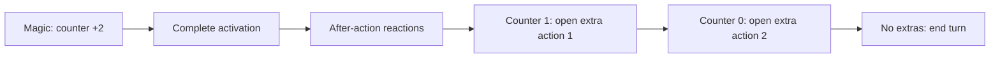

*Activity sketch B. Each completed action goes through `CompleteAction`; Retraction can cut this path short.*

**Worked example:** pay two owned virtues. After any reactions, draw/place a resource as extra action 1, then perform a legal resource move as extra action 2. `ActivePlayer` stays the same throughout. A second draw is not blocked by the previous action's `hasDrawnResource` flag because the flag is reset.

**Edges:** old resource/slot selections must be cleared between actions. A retracted Magic action loses the extra-action grant. A cancelled Magic effect never calls `GrantTwoActions`, but its two-virtue cost remains paid unless the entire original action is later restored by Retraction. There is no explicit ban on using an available paid power as an extra action, nor a blanket per-turn Magic usage cap.

**Existing test:** `MagicGrantsExactlyTwoAdditionalActionsAndResetsTheirSelections`.

<a id="aradas"></a>
### 10.3 The Aradas: Identity Surfing

**Source chain:** [Aradas.asset](../Busara/Assets/Busara/ScriptableObjects/Kingdoms/Aradas.asset) -> [Identity Surfing.asset](../Busara/Assets/Busara/ScriptableObjects/Kingdoms/PowerObjects/Identity%20Surfing.asset) -> [IdentitySurfing.cs](../Busara/Assets/Busara/script/PowerEffect/IdentitySurfing.cs). The display name is **The Aradas**, even though the filename omits "The".

**Player-facing rule:** pay **three virtues** on your own turn to exchange kingdom cards with another participating player. This exchanges victory goals and available powers with the cards, not the players' physical boards or virtue collections.

**Implementation walkthrough:** `Configure` collects another-player target; `Validate` rejects null, self, and non-participant targets. Commit first reveals the caster's current card. `IdentitySurfing.Execute` swaps the two `Kingdom` references and their corresponding `kingdomRevealed` booleans, then completes. `virtuesHidden` and `knownKingdoms` are not swapped.

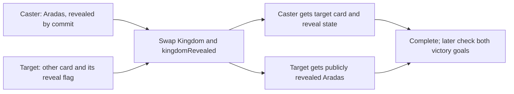

*Data-flow sketch C. The two properties travel together; inventories and boards stay with their players.*

**Worked example:** Ada owns The Aradas and pays three virtues; Bo owns hidden Egolica. Ada ends with hidden Egolica and Bo ends with revealed The Aradas. Ada can potentially use hidden-only Abundance on a later legal action, because Egolica's card was not revealed by this exchange. Both retain their remaining virtues and their own boards.

**Edges:** this is not exchanging player identities, names, resources, or controller roles. Existing private knowledge follows known Kingdom assets when they move. The other player can now meet their new kingdom's goal, so the normal turn-end win check must examine all players, not only the caster.

**Existing tests:** `IdentitySurfingSwapsKingdomAndRevealStateOnly`, `TargetedPowersRejectMissingSelfAndNonParticipantTargets`, and `KingdomExchangeCanWinForTheOtherPlayer`.

<a id="eko-akete"></a>
### 10.4 Eko Akete: Transform

**Source chain:** [Eko Akete.asset](../Busara/Assets/Busara/ScriptableObjects/Kingdoms/Eko%20Akete.asset) -> [New Transform Power.asset](../Busara/Assets/Busara/ScriptableObjects/Kingdoms/PowerObjects/New%20Transform%20Power.asset) -> [TransformPower.cs](../Busara/Assets/Busara/script/PowerEffect/TransformPower.cs). The historical asset filename is not a second power.

**Player-facing rule:** pay **four virtues** to activate, then exchange separately selected virtues for the same number of one chosen virtue type. Hidden status is not required.

**Implementation walkthrough:** `Payment` and `Exchange` are different lists. `ExchangeMenu` subtracts the tentative payment's multiplicity when showing exchange availability. `Validate` combines both lists to prove ownership. It also checks the chosen type's current stock plus chosen-type tokens that will be returned by payment/exchange. Only after commit does `TransformPower.Execute` remove the exchange tokens and add `ChosenVirtue` once per exchange entry. It does not charge the activation payment a second time.

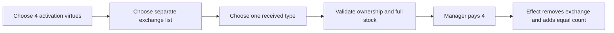

*Activity sketch D. Unlike resource additions, this virtue exchange is validated for full supply, not partially fulfilled.*

**Worked example:** hold six virtues. Put four into `Payment` and the remaining two into `Exchange`; choose Wisdom with enough stock. Commit spends four; execution replaces the other two with two Wisdom tokens. Finish with two virtues, not six, and no extra four-token charge inside the effect.

**Edges:** selecting the same physical multiplicity in payment and exchange is invalid. Returned Wisdom payment/exchange tokens can supply the conversion, so looking only at pre-payment stock would reject some legal exchanges. The code permits a zero-length exchange if a received virtue is selected: activation still costs four and the effect converts nothing. That is current validation behavior, not a recommended strategic move.

**Existing tests:** `TransformRequiresExchangeInAdditionToActivationPayment`, `TransformStockIncludesReturnedPaymentButCannotOverdrawStockpile`, and `TransformProducesOnlyChosenTypeAndDoesNotChargeActivationTwice`.

<a id="ilagik"></a>
### 10.5 ILAGIK: Witchcraft

**Source chain:** [ILAGIK.asset](../Busara/Assets/Busara/ScriptableObjects/Kingdoms/ILAGIK.asset) -> [Witchcraft.asset](../Busara/Assets/Busara/ScriptableObjects/Kingdoms/PowerObjects/Witchcraft.asset) -> [Witchcraft.cs](../Busara/Assets/Busara/script/PowerEffect/Witchcraft.cs).

**Player-facing rule:** pay **three virtues** on your turn to rearrange resources inside your own kingdom. You can make multiple moves/swaps and explicitly finish; this is not a single adjacent-step move.

**Implementation walkthrough:** `Execute` delegates to `PowerEffects.Rearrange`. It builds a choice for each caster resource plus Finish. Selecting a resource opens every other caster-board slot as a destination, labeling occupied slots as swaps. `SwapOrMove` handles the slot relationships, then reopens the resource menu. Destination Back returns without a move. Only Finish invokes `use.Complete`.

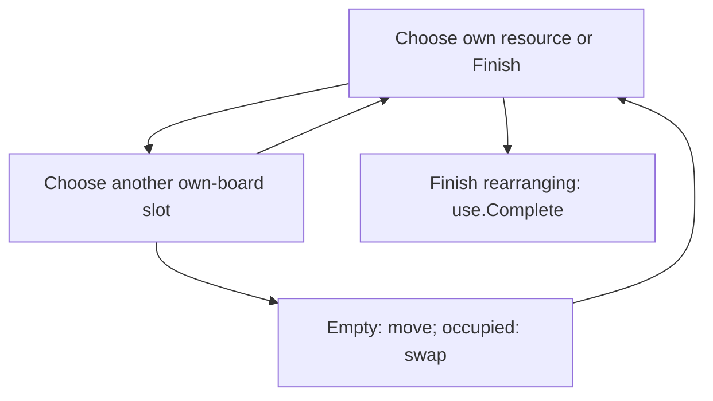

*Activity sketch E. The return edge from destination selection represents Back; movement edges repeat until explicit Finish.*

**Worked example:** Fire is at slot A and Water at slot B on your board. Choose Fire, then B: Fire and Water swap. Choose Fire again and an empty slot C: it moves there. Finish to release the busy lock and reach after-action reactions.

**Edges:** no extra virtues are charged per internal move. A full board still allows swaps; there need not be an empty slot. An empty board still offers Finish. The original action remains open during every internal rearrangement, so do not call `CompleteTurn` after each move or allow other action buttons between them. The helper does not enforce ordinary adjacency restrictions on this power's destinations.

**Existing tests:** `WitchcraftAllowsRepeatedMovesAndSwapsUntilExplicitFinish` and `WitchcraftCanSwapAndFinishOnAFullBoard`.

<a id="bis-bese-avouman"></a>
### 10.6 Bis-Bese Avouman: King's Necklace

**Source chain:** [Bis-Bese Avouman.asset](../Busara/Assets/Busara/ScriptableObjects/Kingdoms/Bis-Bese%20Avouman.asset) -> [Kings Necklace.asset](../Busara/Assets/Busara/ScriptableObjects/Kingdoms/PowerObjects/Kings%20Necklace.asset) -> [KingsNecklace.cs](../Busara/Assets/Busara/script/PowerEffect/KingsNecklace.cs).

**Player-facing rule:** pay **three virtues** when offered a reaction to another player's committed power to cancel that power's effect. Hidden status is not required; the power button does not give an unrestricted own-turn cancellation.

**Implementation walkthrough:** `RunCommitted` forms the eligible opponent list and calls `Offer`. Accepting creates a separate `PowerUse` whose completion advances that offer. If the reaction itself survives any nested cancellation, `KingsNecklace.Execute` calls `CancelPendingPower`, then completes. The enclosing `RunCommitted` reads its scoped cancellation flag and shows the cancelled-effect notice instead of calling the original effect.

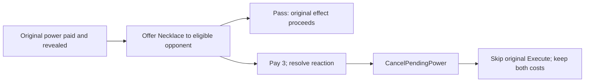

*Activity sketch F. A Necklace reaction can itself be cancelled; section 8.2 explains the saved outer cancellation flag.*

**Worked example:** Konga pays two for Magic. Bis-Bese Avouman pays three for Necklace. If Necklace resolves, Magic adds no additional actions; Konga has spent two and the reactor three. Both activated cards are revealed. Magic's completion path still runs so the game does not stall.

**Edges:** cancellation before commitment (`CancelPower`) is a different operation from this reaction. The original caster cannot use their own Necklace against their same activation. A later Retraction of the original action can restore that action's payment while retaining separately committed reaction payments; "no refund" here describes Necklace cancellation itself, not exemption from the snapshot system.

**Existing test:** `KingsNecklaceCancelsEffectButBothActivationCostsRemainPaid`; shared preparation test `CancellingPreparationDoesNotSpendOrReveal` makes the distinction concrete.

<a id="milu"></a>
### 10.7 Milu: Invisibility

**Source chain:** [Milu.asset](../Busara/Assets/Busara/ScriptableObjects/Kingdoms/Milu.asset) -> [Invisibility.asset](../Busara/Assets/Busara/ScriptableObjects/Kingdoms/PowerObjects/Invisibility.asset) -> [Invisibility.cs](../Busara/Assets/Busara/script/PowerEffect/Invisibility.cs).

**Player-facing rule:** pay **two virtues** on your turn, steal one resource from another player, and hide your virtues from other viewers. Your kingdom card is still publicly revealed by activation; "invisibility" does not mean the kingdom becomes hidden.

**Implementation walkthrough:** target eligibility and final validation require a target resource and an empty caster slot before charging. `Invisibility.Execute` calls `PowerEffects.Steal`, which asks the caster to choose the target's resource, then a destination on the caster's own board. `Board.MoveResource` transfers the existing object. Only after that move does the helper set `virtuesHidden = true` and call `use.Complete`.

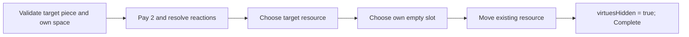

*Activity sketch G. Hiding is tied to successful resource transfer, not to opening the menu.*

**Worked example:** Milu has an empty slot and Bo has a Water resource. After paying two, choose that Water and the empty slot. Water moves to Milu; world stock usage is unchanged. Other players' privacy-aware virtue counters show `?`, while Milu can still see their own virtues.

**Edges:** a full caster board or empty target disables/invalidates the use before payment. If Necklace cancels it, neither theft nor hiding happens. The hiding flag has no end-turn expiry, but Retraction can restore the pre-action flag if it undoes the Invisibility action. Repeated paid uses can still steal again; the asset is not hidden-only.

**Existing tests:** `InvisibilityRequiresResourceAndEmptyDestinationBeforeCharging` and `InvisibilityHidesVirtuesOnlyAfterResourceAndDestinationChoices`.

<a id="empire-volta"></a>
### 10.8 Empire Volta: Celestial Dome

**Source chain:** [Empire Volta.asset](../Busara/Assets/Busara/ScriptableObjects/Kingdoms/Empire%20Volta.asset) -> [Celestial Dome.asset](../Busara/Assets/Busara/ScriptableObjects/Kingdoms/PowerObjects/Celestial%20Dome.asset) -> [CelestialDome.cs](../Busara/Assets/Busara/script/PowerEffect/CelestialDome.cs).

**Player-facing rule:** pay **one virtue** in an offered attack/disaster protection window, or pass. No hidden-only gate. It does **not** prevent another kingdom's power merely because the power is harmful.

**Implementation walkthrough:** weapon and disaster code call `OfferProtection(defender, threat, prevented, proceed)`. If the defender cannot use Dome, `proceed` runs immediately. Otherwise the reaction can be prepared/paid. `CelestialDome.Execute` calls `CancelPendingThreat` and completes its offer; `OfferProtection` then closes the UI and dispatches exactly one of the supplied callbacks.

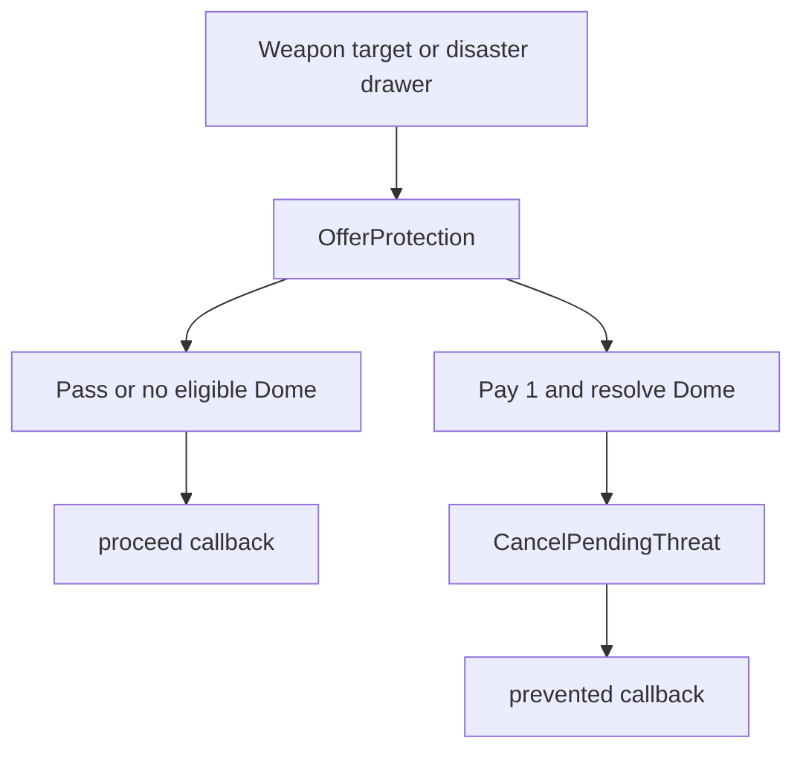

*Activity sketch H. If King's Necklace cancels Dome before its effect executes, the threat proceeds despite Dome's spent cost.*

**Worked example:** a weapon targets Empire Volta, which pays one virtue. The defender is removed from the targets that must discard, while any other targets still resolve their own discard phase. The attacker's spent weapon resources stay spent.

**Edges and implementation choice:** for disasters, only the drawer is offered Dome, before any affected-player calculation. A successful prevention bypasses the entire disaster execution, not merely the drawer's personal loss. There is no persistent shield status attached to the player and no generic interception inside Rain, Imagination, or Invisibility.

**Existing test:** `CelestialDomeProtectionCanBePaidOrPassed` exercises the protected/proceed callbacks. Inspect [WeaponActionMove](../Busara/Assets/Busara/script/Actions/WeaponActionMove.cs) and [DisasterManager](../Busara/Assets/Busara/script/Managers/DisasterManager.cs) for the different integration semantics; that helper test alone is not proof of every disaster variant.

<a id="nevulandis"></a>
### 10.9 N'evulandis: Infinite Knowledge

**Source chain:** [N'evulandis.asset](../Busara/Assets/Busara/ScriptableObjects/Kingdoms/N'evulandis.asset) -> [Infinite Knowladge.asset](../Busara/Assets/Busara/ScriptableObjects/Kingdoms/PowerObjects/Infinite%20Knowladge.asset) -> [InfiniteKnowledge.cs](../Busara/Assets/Busara/script/PowerEffect/InfiniteKnowledge.cs). Preserve the legacy asset spelling when following links.

**Player-facing rule:** pay **one virtue** on your turn to learn another player's kingdom information privately. Hidden status is not required to cast, and learning a target's card does not publicly reveal it.

**Implementation walkthrough:** target selection runs through the shared other-player menu and validation. The effect adds the target's `Kingdom` asset to the caster's `knownKingdoms` set, formats information from that card, and calls `PowerManager.Notice` with `use.Complete` as its Continue callback. Do not confuse `knownKingdoms.Add` with setting `target.kingdomRevealed = true`.

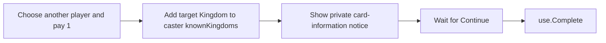

*Activity sketch I. Private knowledge persists beyond this notice; the notice is not a public reveal operation.*

**Worked example:** N'evulandis targets a hidden Logone. After commitment, the caster learns that exact Logone card and its Blessing of Plenty/goal information. A third player still fails `CanSeeKingdom` for hidden Logone. Continue acknowledges the notice and completes the action.

**Edges:** the caster's own kingdom becomes public because they activated a power, while the target's card can remain hidden. If the target's card later moves through Identity Surfing, the caster still knows that card asset. Retraction cannot erase human memory; the code also leaves `knownKingdoms` untouched. The shared-screen UI does not prevent another person from physically reading a private notice.

**Existing test:** `InfiniteKnowledgeRevealsOnlyToItsCasterUntilAcknowledged`, plus `SnapshotRestoresVirtuesKingdomsAndSelectionsWithoutHidingRevealedKnowledge`.

<a id="royaume-kongo"></a>
### 10.10 Royaume Kongo: Manipulation

**Source chain:** [Royaume Kongo.asset](../Busara/Assets/Busara/ScriptableObjects/Kingdoms/Royaume%20Kongo.asset) -> [Manipulation.asset](../Busara/Assets/Busara/ScriptableObjects/Kingdoms/PowerObjects/Manipulation.asset) -> [Manipulation.cs](../Busara/Assets/Busara/script/PowerEffect/Manipulation.cs).

**Player-facing rule:** pay **three virtues** at the start of another player's normal turn to choose their action; trading is prohibited while control is active. Hidden status is not required.

**Implementation walkthrough:** `BeginNormalTurn` resets control/action-extra state and offers other eligible Manipulation/Time holders their start window. `Prepare` supplies the active player as the reaction target. `Manipulation.Execute` calls `ControlTurn(use.Caster)`; that sets `Controller` and raises a state update. After offers, the manager captures the action snapshot, closes the menu, and shows the controller notice.

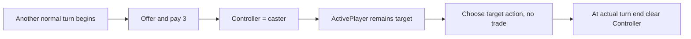

*Activity sketch J. This is local turn control, not transferring the target's board or inventory.*

**Worked example:** Ada's Royaume Kongo reacts before Bo acts. Ada pays three of Ada's virtues, then chooses Bo's legal resource move on Bo's board. Bo remains `ActivePlayer`. When Bo's actual turn finishes, `Controller` is cleared and ordinary viewing/control resumes.

**Edges:** `Viewer` becomes the controller; control does not automatically grant knowledge of the target's hidden card or hidden virtues. Ordinary action handlers still operate on the active player's data. If Magic opens extra actions in that same turn, control persists until the actual end. With artificial duplicate Manipulation kingdoms, later successful assignments overwrite the controller in list order; standard setup prevents that duplication. This is not remote-player input authorization.

**Existing test:** `BeginNormalTurnOffersManipulationAndClearsControlAfterAction`. For trade restrictions, trace [TradeActionMove](../Busara/Assets/Busara/script/Actions/TradeActionMove.cs) and [TradeManager](../Busara/Assets/Busara/script/Managers/TradeManager.cs).

<a id="kavango-keendobe"></a>
### 10.11 Kavango Keendobe: Rain

**Source chain:** [Kavango Keendobe.asset](../Busara/Assets/Busara/ScriptableObjects/Kingdoms/Kavango%20Keendobe.asset) -> [Rain.asset](../Busara/Assets/Busara/ScriptableObjects/Kingdoms/PowerObjects/Rain.asset) -> [Rain.cs](../Busara/Assets/Busara/script/PowerEffect/Rain.cs).

**Player-facing rule:** pay **three virtues** on your own turn; choose whether **everyone** adds or removes the same count of **one, two, or three resources**. Each affected player chooses their own actual pieces and, for additions, spaces. Hidden status is not required.

**Implementation walkthrough:** `Configure` writes `ResourceCount` and `RemoveResources`, then confirms. Final validation enforces 1-3. `Rain.Execute` delegates to `PowerEffects.Rain`, which processes `PlayerManager.Players` from index zero, including the caster. Each add/remove helper receives a continuation to the next player. The last participant invokes `use.Complete`.

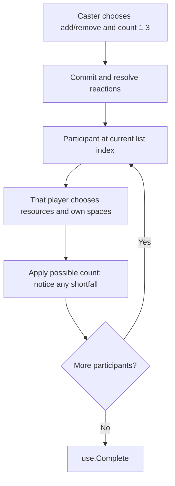

*Activity sketch K. One common operation, individual choices; no simultaneous random distribution.*

**Worked example:** Rain requests that three players remove two resources each. Ada chooses two of her five; Bo has one and removes it, then acknowledges the empty-board notice; Cy has none and acknowledges their notice. Requested count is uniform, but actual removal totals are 2, 1, and 0 by the chosen best-effort policy.

**Edges:** adding uses current shared stock and each owner's free slots. A full player does not block later players. Stock is consumed in participant-list order. Rain is a power, so Celestial Dome is not offered; King's Necklace can cancel the whole effect before the per-player loop. No extra power activation is charged to affected players.

**Existing tests:** `RainValidatesItsOneToThreeResourceLimit`, `RainAddsForEveryPlayerWithIndependentChoicesAndBestEffortCapacity`, and `RainRemovesChosenResourcesForEveryPlayerAndSkipsEmptyBoards`.

<a id="ubunifu"></a>
### 10.12 Ubunifu: Imagination

**Source chain:** [Ubunifu.asset](../Busara/Assets/Busara/ScriptableObjects/Kingdoms/Ubunifu.asset) -> [Imagination.asset](../Busara/Assets/Busara/ScriptableObjects/Kingdoms/PowerObjects/Imagination.asset) -> [Imagination.cs](../Busara/Assets/Busara/script/PowerEffect/Imagination.cs).

**Player-facing rule:** pay **three virtues** on your turn to take one chosen virtue from another player. Hidden status is not required. This transfers a virtue; it is not "create any virtue from the stockpile."

**Implementation walkthrough:** choose an eligible target with virtues, then choose a virtue from `ForgeManager.AllVirtues`. `Validate` checks that the target actually contains that exact selected reference. After the manager commits activation cost, `Imagination.Execute` removes one occurrence from `Target.Virtues`, adds that same reference to `Caster.Virtues`, and completes.

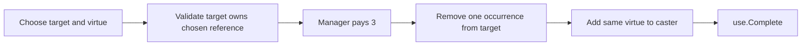

*Activity sketch L. A list can contain duplicates; `Remove` removes one occurrence, not the entire type.*

**Worked example:** Bo owns two Nature virtues. Ada's Ubunifu pays three and chooses Nature from Bo. Bo has one Nature left; Ada gains one Nature. Total Nature supply held by all players does not increase from the transfer itself.

**Edges:** the menu does not promise every displayed virtue is available on the target; invalid final choice returns an error without spending. It rejects self/non-participant targets. There is no resource-slot requirement and no stockpile availability requirement for transferring an already-owned virtue. The target's privacy flag is not cleared by the transfer. Inventory change is reflected when the completion/state notifications refresh displays.

**Existing tests:** `ImaginationRejectsAnUnavailableVirtueWithoutSpending`, `ImaginationTransfersExactlyOneOfDuplicateVirtues`, and `TargetedPowersRejectMissingSelfAndNonParticipantTargets`.

<a id="logone"></a>
### 10.13 Logone: Blessing of Plenty

**Source chain:** [Logone.asset](../Busara/Assets/Busara/ScriptableObjects/Kingdoms/Logone.asset) -> [Blessing of Plenty.asset](../Busara/Assets/Busara/ScriptableObjects/Kingdoms/PowerObjects/Blessing%20of%20Plenty.asset) -> [BlessingOfPlenty.cs](../Busara/Assets/Busara/script/PowerEffect/BlessingOfPlenty.cs). Logone's corrected power binding matters: an effect class existing in the project is insufficient if the kingdom points elsewhere.

**Player-facing rule:** pay **four virtues** on your turn to duplicate the resource multiset currently on your board, as far as stock and spaces allow. Hidden status is not required.

**Implementation walkthrough:** `Execute` snapshots resource types into a local `copies` list, then calls `AddResources(caster, copies.Count, use.Complete, copies)`. This small local copy is **not** `TurnSnapshot`: it describes which duplicates remain to be produced. The helper offers distinct available types, but removes just one occurrence of the chosen type after each placement.

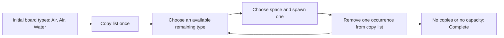

*Data-flow sketch M. Newly spawned pieces are never added back into the copy list.*

**Worked example:** start with two Air and one Water and room for three more. Choose Water, then Air, then Air; the final board has four Air and two Water. If only one space remains, choose which one of those three potential copies fits; the effect does not hardcode an arbitrary first type.

**Edges:** no resources means no copies and immediate effect completion after the paid activation. A type with exhausted global stock is excluded, while other available copies can still be produced. A full board shows the shortfall notice. Reading the live board count after every addition would incorrectly grow the requested workload; the initial multiset prevents that.

**Existing tests:** `BlessingDuplicatesTheInitialMultisetRatherThanNewlyAddedPieces`, `BlessingLetsPlayerChooseWhichCopyFitsWhenSpaceIsLimited`, and `BlessingSkipsExhaustedStockAndStillAddsOtherCopies`.

<a id="telalila"></a>
### 10.14 Telalila: Time

**Source chain:** [Telalila.asset](../Busara/Assets/Busara/ScriptableObjects/Kingdoms/Telalila.asset) -> [Time.asset](../Busara/Assets/Busara/ScriptableObjects/Kingdoms/PowerObjects/Time.asset) -> [TimePower.cs](../Busara/Assets/Busara/script/PowerEffect/TimePower.cs). The class avoids collision with Unity's `Time` type.

**Player-facing rule:** pay **two virtues** during an offered other-player window to queue an extra turn for yourself. Hidden status is not required. The implementation offers it before another player's normal action and after that action, rather than interrupting at arbitrary moments.

**Implementation walkthrough:** `TimePower.Execute` calls `ScheduleTurn(use.Caster)` and completes the reaction. The currently active turn continues until its real end. `TurnManager.FinishNormalTurn` computes the sequential neighbor, then asks `PowerManager.NextPlayer` whether a queued extra should run first. FIFO queue order and `resumePlayer` preserve the original return point.

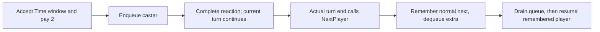

*Activity sketch N. See Figure 7 for the concrete A/C/D/B scheduler example.*

**Worked example:** in order Ada, Bo, Cy, Ada is active and Cy has Telalila. Cy pays two at Ada's after-action window. Ada finishes; Cy takes the queued turn; then Bo takes the normal next turn. It does not skip Bo just because Cy's usual neighbor would be Ada.

**Edges:** the code can offer Time in both windows, with a separate payment for each accepted use. The queue is not part of Retraction's snapshot, so independently paid queued turns survive undo. Start-window payments are already included in the later action snapshot; after-action reaction payments need explicit reapplication when that action is restored. Necklace cancellation prevents the enqueue while keeping the committed Time cost.

**Existing tests:** `TimeQueuesInOrderAndResumesTheOriginalSequentialPlayer` and `RetractionPreservesEarlierTimeReactionPaymentAndQueuedTurn`.

<a id="mask-of-light"></a>
### 10.15 Mask of Light: Retraction

**Source chain:** [Mask of Light.asset](../Busara/Assets/Busara/ScriptableObjects/Kingdoms/Mask%20of%20Light.asset) -> [Retraction.asset](../Busara/Assets/Busara/ScriptableObjects/Kingdoms/PowerObjects/Retraction.asset) -> [Retraction.cs](../Busara/Assets/Busara/script/PowerEffect/Retraction.cs).

**Player-facing rule:** pay **two virtues** after another player's action resolves to undo that action before the turn finishes. Hidden status is not required. It is neither arbitrary history rewind nor the Unity Editor Undo command.

**Implementation walkthrough:** `CompleteAction` offers Retraction only if an action snapshot exists and no successful retraction has already occurred. `Validate` additionally requires **all independent reaction payments** to be affordable from the snapshot inventories. `Retraction.Execute` delegates to `PowerManager.Retract`; that method restores state, reapplies reaction costs, clears Magic extras, marks the action retracted, and completes via a notice.

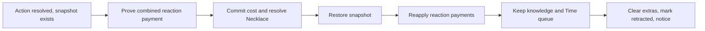

*Activity sketch O. Figure 9 expands the same path as a UML sequence diagram.*

**Worked example:** Bo performs a resource move. Ada's Mask of Light had two virtues at snapshot time and pays them to retract. The board returns to its earlier resource layout; Ada still has spent those two virtues; public card knowledge remains. If another player already paid Time in the after-action window, their payment and queued turn also survive.

**Edges:** if Ada only gained the necessary virtues during Bo's action, restoration would remove those gains, so the payment proof rejects the undo. An own-turn power's cost belongs to the undone action and can be restored; separately committed reaction costs are then deducted again. Retraction does not automatically offer Bo a replacement action: it cancels extras and proceeds toward ending the turn. If Necklace cancels Retraction, its cost stays paid but no snapshot restore occurs.

**Existing tests:** `RetractionRestoresActionSnapshotAndKeepsItsOwnPaymentSpent`, `RetractionRejectsPaymentAcquiredOnlyDuringTheUndoneAction`, `RetractionPreservesEarlierTimeReactionPaymentAndQueuedTurn`, `SnapshotPaymentUsesOriginalMultiplicityNotLaterGains`, and `SnapshotRestoresVirtuesKingdomsAndSelectionsWithoutHidingRevealedKnowledge`.

<a id="adding-a-power"></a>
## 11. Adding a power safely

This chapter is a development checklist, not instructions to modify existing balance casually. Work on a separate change with a clearly stated rule and tests.

### 11.1 Start with the contract, not the button

Write down: who may cast, the exact cost, the legal window, who chooses each target/resource/space, the effect's completion condition, whether partial application is allowed, what is revealed, and how the action interacts with Necklace, Dome, Time, and Retraction.

Ask separately whether it needs **per-use options**, **persistent player state**, or **manager scheduling state**. A chosen target belongs in `PowerUse`; a lasting hiding flag belongs on a player; a queue of future turns belongs in the turn/power coordinator. None belongs on the shared definition merely because it is convenient to edit in the Inspector.

### 11.2 Wire all four layers

1. Create the concrete `Power` subclass and implement `Execute(PowerUse use)`. Use the existing helper that maintains slot/inventory invariants. Finish by calling the supplied continuation exactly once, potentially after a user notice.
2. If it needs new options, extend `PowerUse` and `PowerManager.Configure`/`Validate` together. A generated target button is not a substitute for final validation.
3. If it is a reaction, integrate its actual offer boundary. Setting `timing` alone is insufficient because current offer lists filter concrete types. Supply a continuation that resumes the interrupted flow, not one that ends the reactor's turn.
4. Create a power asset, assign cost/timing/hidden-only flag, then assign it to a kingdom asset with tested victory requirements. Add the kingdom to the catalog and preserve all `.meta` relationships.

The smallest existing effect demonstrates the intended separation:

```csharp
// From Abundance.Execute: payment and reveal have already happened in PowerManager.
PowerEffects.AddResources(
    use.Caster,
    PlayerManager.Instance.Players.Count,
    use.Complete);
```

Do not call this directly from a UI button: it bypasses legality, payment, reveal, cancellation reactions, and the manager's completion wrapper. The direct `Execute(use)` calls found in isolated unit tests deliberately bypass those layers to test only effect behavior.

### 11.3 Extend undo deliberately

If a new action mutates a state field that Retraction should restore, add it to `TurnSnapshot.Capture` and `Restore` together. If it is independent information or a paid reaction commitment that should survive, keep it outside the action rewind and write a regression that proves this distinction.

Do not expand the snapshot by blindly serializing every scene object. That can restore stale callbacks, revive destroyed resource references, or erase information that players already saw. Test both an ordinary use and a use interrupted by a reaction.

### 11.4 Suggested test matrix for a new power

| Concern | Minimum cases |
| --- | --- |
| Configuration | Asset resolves to expected subclass; catalog entry unique; cost/timing/goals correct. |
| Payment | Exact duplicates; too few/many; selected reference not owned; cancellation before commit; no double charge. |
| Options | Null/self/non-participant target where inappropriate; invalid counts; final validation after changing choices. |
| Effects | Normal outcome; no eligible resources; full board; scarce stock; chosen space/type preserved. |
| Completion | No early completion while choices remain; finish/cancel callbacks each invoked only as intended. |
| Reactions | Necklace cancels effect without refund; Dome only if the mechanic is an integrated threat. |
| Turn state | Magic extras reset action flags; Time resumes proper sequence; controlled turns cannot trade. |
| Undo and privacy | Snapshot restores intended state, preserves reaction costs/knowledge, and rejects payment from undone gains. |
| UI | Disabled/stale/reentrant choices cannot repeat mutation; busy modal blocks underlying interactions. |

This matrix is guidance for future tests, not a claim that every Cartesian combination already exists.

<a id="debugging"></a>
## 12. Debugging and testing

### 12.1 A practical source-reading exercise

Pick Logone in setup. Before running anything, put breakpoints at `ActivatePower`, `Prepare`, `PaymentMenu`, `Configure`, `Validate`, `UsePower`, `RunCommitted`, `BlessingOfPlenty.Execute`, `PowerEffects.AddResources`, and `CompleteAction`.

When stepping, write down three different facts: **which player is active**, **which player pays**, and **whose board a callback edits**. They are identical for many own-turn powers, but not for reactions or Rain. Inspect a `PowerUse` rather than assuming the global `preparedUse` remains populated: it is deliberately cleared at commit and can be replaced by nested reaction preparation.

At each resource placement, inspect both the slot and resource back-reference. At each callback, check `IsBusy`, `menuVersion`, and whether the next step is another menu, a notice, the next reactor, or actual turn completion.

### 12.2 Symptom-to-source checklist

| Symptom | Inspect first | Common misconception to avoid |
| --- | --- | --- |
| Power button reports unavailable | `ActivatePower`, asset timing, virtue count, hidden-only flag, action state, special phase | A reaction is not cast by repeatedly clicking the own-turn button. |
| Continue cannot be selected | `PowerRules.CanPay` and payment multiplicities | Having enough total virtues is not the same as owning the selected references. |
| Power costs were paid but nothing happened | `RunCommitted`, Necklace outcome, pending notice | Cancellation after commitment does not refund the price. |
| Turn never finishes | The effect's `use.Complete` and remaining modal choices | Returning from `Execute` is not asynchronous completion. |
| Old button applies twice | `menuVersion`, `choicesRevision`, button listener cleanup | Deleting the button later in the frame is not sufficient by itself. |
| Wrong player acts after Time | `extraTurns`, `resumePlayer`, `NextPlayer` | The extra-turn player's sequential neighbor is not necessarily the saved next player. |
| Magic gives an odd count | `additionalActions` before/after `CompleteAction` | The counter excludes the just-opened action after decrement. |
| Invisibility exposes counts | `Viewer`, `CanSeeVirtues`, `PlayerInfoCard`/`PlayerState` | Hiding data visually must be applied to every relevant display. |
| Swap causes incorrect victory | `Kingdom`/reveal swap, `CheckWinConditions` candidates | The other player's new goal can win too. |
| Undo makes a reaction free | `reactionPayments`, `CanRestorePayments`, `TurnSnapshot.CanPay` | Current inventory is not sufficient evidence after undo. |
| Board loses/duplicates a piece | `Slot` links, `SwapOrMove`, snapshot reconstruction | Swapping is not moving one resource over another occupied slot. |
| Setup's chosen kingdom changes | Scene flags and `TryConfigurePlayers`/`DealKingdoms` | Do not run legacy random dealing after explicit selection. |

### 12.3 Existing executable documentation

[KingdomPowerTests.cs](../Busara/Assets/Busara/script/Editor/KingdomPowerTests.cs) contains **67 NUnit cases** in the restored implementation, including parameterized cases. Case count is not the same as test-method count.

Useful shared regressions, in addition to those linked in the individual walkthroughs:

| Test method | What to learn |
| --- | --- |
| `PaymentRequiresExactOwnedMultiplicityWithoutMutation` | Validate a tentative multiset without changing ownership. |
| `PaymentRejectsUnownedNullAndMissingLists` | Invalid inputs must not become success-shaped payments. |
| `PowerVerificationRejectsRepeatedSelectionNotOwnedTwice` | Legacy payment verification uses exact ownership too. |
| `CancellingPreparationDoesNotSpendOrReveal` | Cancellation before the transaction boundary is free. |
| `CommittingChargesExactDuplicatePaymentAndRevealsOnlyOnce` | Commit clears prepared state and charges once. |
| `ChoiceCallbacksRejectDisabledAndStaleSelections` | Manager-level menu versioning matters beyond Buttons. |
| `PendingPowerChoiceBlocksResourceDiscardAndSpecialPhaseCompletion` | Modal state guards underlying resource/special actions. |
| `PendingChoicesBlockSpecialTurnCompletion` | Direct special completion cannot escape the busy gate. |
| `CatalogContainsFifteenDistinctKingdomsAndPowerAssets` | A complete catalog must contain distinct valid references. |
| `CatalogKingdomHasExpectedPowerCostTimingAndVictoryGoals` | Parameterized assets verify the fifteen-card rules table. |

The later player-setup suite contains 18 cases plus one actual menu/Play flow case. The historical combined validation also included the independent Editor MCP suite; its two Windows symlink-permission skips are **not** skipped kingdom behavior tests. Documentation work does not require launching Unity or rerunning those tests.

When you do change runtime code, use Unity's Test Runner **EditMode** tab and select the relevant classes. The scene integration test deliberately enters/exits Play Mode from an EditMode coroutine; save your own scene drafts before running it. It exercises add/remove, all 15 dropdown choices, explicit Start, retained assignments, board positions, and resource setup.

For a command-line run, close any Editor already using this same project first. From the repository root in PowerShell, replacing the installed Editor version/path if necessary:

```powershell
& "C:\Program Files\Unity\Hub\Editor\6000.3.6f1\Editor\Unity.exe" `
  -batchmode -nographics `
  -projectPath "$PWD\Busara" `
  -runTests -testPlatform EditMode `
  -testFilter "KingdomPowerTests;PlayerSetupTests;PlayerSetupSceneTests" `
  -testResults "$env:TEMP\busara-kingdom-results.xml" `
  -logFile "$env:TEMP\busara-kingdom-tests.log"
```

Do not add `-quit` to this test-runner invocation: let the test runner finish. A newer Unity Editor can upgrade Packages/ProjectSettings; preserve the user's actual pre-run files, not an assumed clean Git baseline. These commands are instructions for a future developer, not actions performed by writing this guide.

Some existing EditMode cases deliberately exercise runtime resource removal and account for Unity's Destroy-in-EditMode diagnostics. Do not hide all logs globally to make a failing suite green. Read the NUnit result, its assertions, and any specifically expected log messages.

For an already-connected local MCP client, `unity_tests_start` can start the same selected classes and return a job ID, then `unity_job` reports completion. Do not automatically retry a mutation after an uncertain timeout. Consult the [MCP README](../tools/unity-mcp/README.md) for connection/auth and job semantics rather than adding MCP dependencies to runtime power classes.

<a id="source-map"></a>
## 13. Source map and implementation boundaries

### 13.1 Files to keep open while learning

| Responsibility | Source |
| --- | --- |
| Kingdom definition and goals | [Kingdom.cs](../Busara/Assets/Busara/script/Core/Kingdom.cs) |
| Power base and timing enum | [Power.cs](../Busara/Assets/Busara/script/Core/Power.cs) |
| Per-use data and stock/payment helpers | [PowerUse.cs](../Busara/Assets/Busara/script/Core/PowerUse.cs) |
| Player visibility and mutable holdings | [Player.cs](../Busara/Assets/Busara/script/Core/Player.cs) |
| Catalog definition/data | [KingdomCatalog.cs](../Busara/Assets/Busara/script/Core/KingdomCatalog.cs), [KingdomCatalog.asset](../Busara/Assets/Busara/ScriptableObjects/Kingdoms/KingdomCatalog.asset) |
| Setup model and rules | [PlayerSetupEntry.cs](../Busara/Assets/Busara/script/Core/PlayerSetupEntry.cs) |
| Setup UI and assignment | [PlayerSetupUI.cs](../Busara/Assets/Busara/script/UI/PlayerSetupUI.cs), [PlayerManager.cs](../Busara/Assets/Busara/script/Managers/PlayerManager.cs) |
| Activation, payment, offers, scheduling | [PowerManager.cs](../Busara/Assets/Busara/script/Managers/PowerManager.cs) |
| Resource choice loops | [PowerEffects.cs](../Busara/Assets/Busara/script/PowerEffect/PowerEffects.cs) |
| Turn phases and action gating | [TurnManager.cs](../Busara/Assets/Busara/script/Managers/TurnManager.cs), [ActionManager.cs](../Busara/Assets/Busara/script/Managers/ActionManager.cs) |
| Transaction snapshot | [TurnSnapshot.cs](../Busara/Assets/Busara/script/Core/TurnSnapshot.cs) |
| Board/resource links | [Board.cs](../Busara/Assets/Busara/script/Core/Board.cs), [Slot.cs](../Busara/Assets/Busara/script/Core/Slot.cs), [Resource.cs](../Busara/Assets/Busara/script/Core/Resource.cs), [BoardManager.cs](../Busara/Assets/Busara/script/Managers/BoardManager.cs) |
| Choice overlay and `PowerChoice` | [PowerUIManager.cs](../Busara/Assets/Busara/script/UI/Power/PowerUIManager.cs) |
| Privacy-aware UI | [DisplayManager.cs](../Busara/Assets/Busara/script/UI/Display%20Managers/DisplayManager.cs), [PlayerInfoCard.cs](../Busara/Assets/Busara/script/UI/Display%20Managers/PlayerInfoCard.cs), [PlayerState.cs](../Busara/Assets/Busara/script/UI/Display%20Managers/PlayerState.cs), [PlayerRepresentation.cs](../Busara/Assets/Busara/script/UI/Display%20Managers/PlayerRepresentation.cs) |
| Ordinary input/action integrations | [SelectionManager.cs](../Busara/Assets/Busara/script/Managers/SelectionManager.cs), [DrawResourceActionMove.cs](../Busara/Assets/Busara/script/Actions/DrawResourceActionMove.cs), [MoveResourceActionMove.cs](../Busara/Assets/Busara/script/Actions/MoveResourceActionMove.cs), [PowerActionMove.cs](../Busara/Assets/Busara/script/Actions/PowerActionMove.cs) |
| Trading/forging integrations | [TradeManager.cs](../Busara/Assets/Busara/script/Managers/TradeManager.cs), [TradeActionMove.cs](../Busara/Assets/Busara/script/Actions/TradeActionMove.cs), [ForgeManager.cs](../Busara/Assets/Busara/script/Managers/ForgeManager.cs) |
| Protection and special completion | [WeaponActionMove.cs](../Busara/Assets/Busara/script/Actions/WeaponActionMove.cs), [DisasterManager.cs](../Busara/Assets/Busara/script/Managers/DisasterManager.cs), [ResourceDisaster.cs](../Busara/Assets/Busara/script/DisasterEffects/ResourceDisaster.cs), [CorruptionDisaster.cs](../Busara/Assets/Busara/script/DisasterEffects/CorruptionDisaster.cs) |
| Victory evaluation | [GameManager.cs](../Busara/Assets/Busara/script/Managers/GameManager.cs) |
| Authored entry scenes | [mainMenu.unity](../Busara/Assets/Scenes/mainMenu.unity), [GameScene.unity](../Busara/Assets/Scenes/GameScene.unity) |
| Executable behavior examples | [KingdomPowerTests.cs](../Busara/Assets/Busara/script/Editor/KingdomPowerTests.cs), [PlayerSetupTests.cs](../Busara/Assets/Busara/script/Editor/PlayerSetupTests.cs), [PlayerSetupSceneTests.cs](../Busara/Assets/Busara/script/Editor/PlayerSetupSceneTests.cs) |

### 13.2 Rule intention versus concrete implementation

The original kingdom-card rules were cross-checked against the preserved extracted rules during documentation research. This guide paraphrases those intentions and uses assets/tests/code for exact behavior. No external PDF or web service is needed to read this document or its SVG illustrations.

| Intention / phrase | What the implemented game actually does |
| --- | --- |
| "2-6 players" in broader rules | Current authored scene exposes 2-4 supported seats. More requires board/geometry/UI work, not merely raising a numeric cap. |
| "Any time during another player's turn" | Time has specific before/after-action offers; Retraction has an after-action offer. There is no arbitrary asynchronous interrupt API. |
| "Show a kingdom card" | Infinite Knowledge records private knowledge of that Kingdom asset and shows name/story/power/description/goals. It does not reveal current hidden virtues. |
| "Move resources freely" | Witchcraft's own-board menu allows repeated moves/swaps until explicit Finish, without ordinary adjacency restrictions. |
| "Double resources" | Blessing copies the initial multiset once, subject to stock and capacity; not unlimited growth. |
| "Everyone adds/removes" | Rain uses the same requested operation/count, but separate owner choices and sequential best-effort application. |
| "Prevent an attack/disaster" | Dome is wired to weapon targets and the disaster drawer; drawer prevention bypasses disaster execution. It does not stop power effects. |
| "Undo the action" | Restore the specifically captured state while retaining learned/revealed information and independent paid reactions/queued turns. |
| "Hidden" | Kingdom reveal, private kingdom knowledge, and hidden virtues are separate mechanisms, not one universal secrecy flag. |

### 13.3 Boundaries a junior developer should not miss

The assets are conventionally immutable, but the language does not enforce that. `CanUse` is a coarse availability check, not full target/timing validation. Many manager APIs assume the scene singletons and collections are correctly initialized. `Execute(PowerUse)` assumes it was reached through the validated manager path unless a test intentionally bypasses it.

There is no remote-authoritative multiplayer layer or private per-device display routing. The generic local choice UI names the intended actor but does not verify who clicked. Information privacy is a gameplay display rule, not protection from the local process owner.

Reactions are concrete-type lists in participant order; adding a new `PowerTiming` enum value without integration does nothing useful. Paid abilities have no general cooldown/once-per-game tracking; Abundance's hidden-only restriction is the exception. The snapshot is not durable match saving, and board-state strings do not preserve GameObject identity or arbitrary resource-component fields.

The diagrams deliberately simplify event listeners and rendering details. UML class/sequence diagrams use Mermaid; the state diagram and fifteen per-power activity/data-flow sketches are explanatory models. Markdown renderers without Mermaid support will show those code blocks rather than diagrams. The four locally authored SVGs remain viewable offline with no scripts, external fonts, or network image references.
