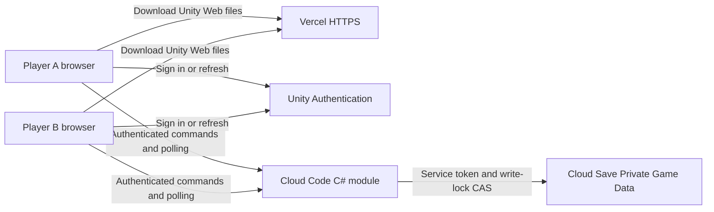

# Reusing Busara's Unity multiplayer architecture

Reference date: October 3, 2026. This explains the implemented design and how
to adapt it to another game. Commands are Busara repository scripts, not
generic Unity commands. Run PowerShell examples from the repository root,
replace placeholders, execute steps separately, and stop on failure.

**How to read navigation:** `>` means select the next menu/page. Start Unity
Dashboard steps at [cloud.unity.com](https://cloud.unity.com/) and Vercel steps
at [vercel.com/dashboard](https://vercel.com/dashboard). Always check the
selected organization/team, project and environment before changing anything.
Dashboard group labels can change: Unity services may appear under **Products**
or **LiveOps**. Select the named service if that grouping differs. Missing
administration controls can indicate insufficient permissions; do not grant
broader roles merely to make a menu appear.

**For every PowerShell step:** Windows Start > search **PowerShell** > open
Windows PowerShell, then run `Set-Location 'C:\path\to\your-game-repository'`.
Use the folder containing `README.md`, `online` and the nested `Busara` folder.
Terminal commands are not entered into the Unity Dashboard or Unity Console.

## 1. What runs where

**Unity Gaming Services hosts the backend; Vercel hosts the playable website.**
The Unity game runs in each player's browser, not inside Cloud Code.



| Component | Responsibility | Not responsible for |
| --- | --- | --- |
| Unity Web client | Input, board rendering, authorized views, retry outbox | Authoritative state or hidden opponent data |
| Unity Authentication | Anonymous player identity and token refresh | Game seat ownership or match rules |
| Cloud Code module | Verify actor/seat, validate actions, apply rules, return private views | A continuously running Unity simulation |
| Cloud Save Private Game Data | Durable matches, pending decisions, receipts, guest ledgers | Direct browser storage access |
| Vercel static hosting | Deliver HTML, JavaScript, WebAssembly and Unity data over HTTPS | Building Unity or executing backend C# |

Players need only a browser and the website URL, including on different PCs
and networks. They do not need Node, the Unity Editor, CLI tools, port
forwarding, or a local server. A local Node HTTPS server is only a developer
alternative for serving static files.

This is a bounded, turn-based architecture using HTTPS polling. It does not
use Lobby, Relay, Netcode, a dedicated Unity server, or PostgreSQL on the UGS
path. A room is a durable record, not a newly allocated server process.
For real-time action games, evaluate a different simulation/networking model.

## 2. Follow one match through the system

**Where to play:** Open the deployed game's stable HTTPS URL > **Create guest**
> create a room > copy its invitation. In a second browser profile or on a
second PC, open the invitation > **Create guest** > join. Ready both seats,
then start from the host. These are game controls, not Dashboard operations.
The Cloud Code and storage steps below happen automatically.

1. A browser signs in anonymously. The adapter retains the session token in
   browser local storage and the access token in memory.
2. Cloud Code registers that authenticated identity as a Busara guest.
   The fixed guest lifetime is 30 days; token refresh does not extend it.
3. Player A creates a room. The server stores the host membership and returns
   a private invitation with a single-use, 24-hour expiry.
4. Player B opens the invitation on the same website and authenticates with
   a different identity. The server verifies the invitation and assigns a seat.
5. Both players ready up; the host starts. Commands include `commandId`,
   `expectedVersion`, the action and, when applicable, `decisionId` and payment.
6. Cloud Code derives the actor from `context.PlayerId`, verifies membership,
   and applies shared rules. It never trusts a caller-supplied seat identity.
7. It atomically persists the room's new state, command receipt and event
   using Cloud Save's write lock, then acknowledges the command.
8. Each browser receives only its authorized projection. The acting client
   can receive a receipt plus view; the other client discovers updates by polling.

After uncertain delivery, resend the **same command ID and exact body**.
The server checks saved duplicates before stale-version rejection; changing
the body under an existing ID is a conflict. A pending decision stores its
owner and continuation, so reload or worker replacement does not silently
Pass, spend twice, or skip a turn.

Browser storage belongs to the website origin/profile. A match URL alone
cannot restore identity on another browser; clearing storage can lose a seat.
Account linking/recovery is a separate requirement for another game's release.

## 3. Keep the game separate from infrastructure

**Where to find the code:** In your code editor, **File > Open Folder** >
repository root, then expand the paths below. In the Unity Editor's **Project**
window, `Assets > Busara > Online` contains shared rules and the client;
the repository-level `online` backend folder is outside Unity's `Assets`.

| Source in this repository | Reuse pattern |
| --- | --- |
| `Busara\Assets\Busara\Online\Shared\Runtime` | Unity-independent C# contracts, rules, stable IDs and per-seat projections |
| `Busara\Assets\Busara\Online\Client` | Unity presentation and session handling; no authoritative rule execution. The scene is generated from code with EgComponents UI pages and prefabs (`BusaraOnlineSceneBuilder`) |
| `Busara\Assets\Plugins\WebGL\BusaraOnline.jslib` | Browser bridge, reconnect and immutable command outboxes |
| `Busara\Assets\WebGLTemplates\BusaraOnline\busara-ugs.js` | Provider-specific Authentication/Cloud Code REST adapter |
| `online\src\Busara.Ugs\Module.cs` | UGS entry point and authenticated context wiring |
| `online\src\Busara.Ugs\Storage.cs` | `IPrivateStore` contract and `CloudSaveStore` implementation |
| `online\src\Busara.Ugs\MatchService.cs` and partial files | Match orchestration with injected storage, randomness and clock |
| `online\scripts\hosting` | Generic `StaticHostingProvider` extended by `VercelHostingProvider` |

Use small, single-purpose files, generally around 200 lines or fewer where
practical. Keep UI, game rules, storage and deployment responsibilities apart.
Prefer narrow interfaces and composition for service adapters; use a generic
base class when it genuinely supplies shared behavior, as with static exports.
Do not force unrelated providers into an inheritance hierarchy.

For PlayFab, AWS or Firebase, preserve the shared rules/contracts and add
provider-specific authentication, execution, storage and browser adapters.
The storage adapter must preserve conditional writes and atomic room updates,
not merely expose similar CRUD methods. `IPrivateStore` is currently located
in the UGS project; moving it and orchestration into a neutral application
assembly is an explicit refactor for a multi-provider product. Busara is not
already a drop-in implementation of those providers. Its legacy ASP.NET/
PostgreSQL path is separately selected, not an automatic fallback.

## 4. Prepare a new UGS project

### 4.1 Create/select the cloud project

**Navigation:** Unity Dashboard > select your organization > project selector
> **Create project** (or select an existing dedicated project).
This creates the cloud service container, not a local Unity project.

**Find its ID:** Selected project > **Project Settings** > **Project ID**.
Copy the project UUID, not its display name or an organization/service-account ID.

### 4.2 Create/select the environment

**Navigation:** Selected project > **Project Settings > Environments**.
Select `development`, or create an environment with that name if it is absent.
Copy the **Name**, not the **Environment ID** UUID. An environment separates
testing data and deployments from other environments such as production.

For Busara the name is **`development`**. Use that same value for
`ugs config set environment-name` and the build's `-EnvironmentName`.
Select it in the Dashboard's environment selector when inspecting services.
Changing the Dashboard selector does not change your CLI or built client's target.

### 4.3 Open the required services

| Service | Navigation within the selected project | What to do |
| --- | --- | --- |
| Authentication | Products/LiveOps > **Authentication** | Complete any service setup shown. Anonymous sign-in is built in; do not search for it under **Add Identity Provider**. |
| Cloud Code | Products/LiveOps > **Cloud Code > Modules** | Complete any service setup shown. This is where the deployed C# module appears; do not create a JavaScript script instead. |
| Cloud Save | Products/LiveOps > **Cloud Save > Game Data** | Complete any service setup shown. Busara uses Private Game Data/Custom Items, not Player Data. |

This Web implementation uses REST and CLI configuration. Linking the local
Editor is not its routing mechanism. If another project uses Unity Services
SDKs, its linking controls are under **Edit > Project Settings > Services**;
follow that SDK's initialization requirements separately.

#### Set up Authentication for Busara: anonymous guests

**Authentication** gives the game a verified Unity player identity.
An **identity provider** is an optional external account system, such as
Google or Unity Player Accounts, that a player can use to sign in.
Neither is the service account used by the deployment CLI.

1. Unity Dashboard > select your project > Products/LiveOps >
   **Authentication** > complete any initial service setup shown.
2. Open **Identity Providers** (sometimes under Authentication's **Setup**
   or configuration page). For the current Busara milestone, **leave external
   providers unconfigured**. Anonymous sign-in is built in and is not an item
   to add through **Add Identity Provider**.
3. Build the Web client with the correct project UUID and environment name
   using section 6. Its `busara-ugs.js` adapter calls the anonymous
   Authentication REST endpoint when the player explicitly selects
   **Create guest**. No OAuth client secret or service-account key is needed.
4. Open the hosted game > **Create guest** > create/join a room. Reload in the
   same browser profile and origin without clearing storage. The adapter uses
   its saved session token to restore the same identity; it must not silently
   create a new identity if recovery fails.

**Expected result:** a player can create a guest, join a seat and reload back
into that seat. Two ordinary tabs normally share an identity, so use separate
profiles for two players. Losing an unlinked anonymous session token can make
the account unrecoverable. See [Unity's anonymous sign-in guide](https://docs.unity.com/en-us/authentication/use-anon-sign-in).
Busara currently implements anonymous sign-in/session recovery only, not
external-provider sign-in or account linking.

#### Optional: add an identity provider for another game's account system

Adding a provider in the Dashboard only configures the service. It does **not**
add a sign-in button, token exchange or account-linking flow to this Web client.
Choose a provider supported by the target platform and implement its client
integration before presenting it as usable.

1. Unity Dashboard > selected project > **Authentication > Identity Providers
   > Add Identity Provider** > select the intended provider.
2. Follow that provider's setup instructions. If it requires a developer
   application, create/configure that application in the provider's console
   first. Supply only the fields requested by Unity, such as an OAuth client
   ID; configure allowed origins/callbacks for the actual target platform.
   A client ID is not a secret. Never embed a client secret in WebGL/JavaScript.
3. Save using **Add provider** or **Save**, then reopen the provider to verify
   its settings. Do not reuse production credentials or callbacks blindly for
   a development website.
4. Implement the provider's supported sign-in/token flow in the client and
   exchange its credentials for a Unity Authentication player session.
   Keep provider-specific code separate from the shared game rules.
5. For an existing guest, use the provider's **link-account** flow while signed
   in as that guest, preserving its Unity player ID and seat. Signing in as a
   different account is not a migration. Handle already-linked accounts
   explicitly; do not overwrite membership or discard pending commands.
6. Test fresh sign-in, cancellation, returning sign-in, guest linking, token
   refresh and recovery from another supported device. Confirm the same player
   retains its match membership. Add required privacy/data-deletion flows.

**Example: Unity Player Accounts.** In **Add Identity Provider**, choose
**Unity Player Accounts** > enter the requested details/platforms >
**Add provider**. For a supported Unity SDK project, navigate in the Editor
to **Services > Authentication > Configure > Go to Dashboard** to reach the
same provider page; return and **Refresh** after saving. Then use
**Services > Unity Player Accounts > Configure** to verify the Client ID.
Include **PC** for Editor Play Mode testing. Follow
[Unity Player Accounts setup](https://docs.unity.com/en-us/authentication/unity-player-accounts)
for SDK integration and callbacks. Do not copy a desktop localhost callback
into the hosted Web build; verify current WebGL/browser support and its
integration requirements before selecting this option for Busara.

**Example: direct Google sign-in.** Unity's
[Google provider guide](https://docs.unity.com/en-us/authentication/platform-signin/google)
requires obtaining a Google ID token and signing in/linking through Unity
Authentication; configuring the provider alone cannot obtain that token.
The guide flags its older Google token-retrieval approach as deprecated for
new titles. Do not copy the old Android plugin recipe into a new Web project;
choose a currently supported platform flow. Direct Google sign-in and Google
sign-in through Unity Player Accounts are different integrations.

### 4.4 Install the development tools

**Unity navigation:** Unity Hub > **Installs > Install Editor** > select
**6000.3.6f1**. For an existing install, open its options > **Add modules** >
**WebGL Build Support**. If the version is not listed, use Hub's Unity download
archive link. The Editor and WebGL module must match.

**Other tools:** Use the official [.NET SDK download](https://dotnet.microsoft.com/download/dotnet/10.0),
[Node.js download](https://nodejs.org/en/download) and
[UGS CLI installation guide](https://services.docs.unity.com/guides/ugs-cli/latest/general/get-started/install-the-cli/).
Busara pins .NET SDK **10.0.401** and uses Node **22+**. Shared rules target
.NET Standard 2.1; the Cloud Code module targets **.NET 8**, not .NET 10.
For another project, verify current runtime support before choosing versions.

### 4.5 Create deployment credentials and assign roles

**Navigation:** Unity Dashboard > select your organization >
**Administration > Service accounts > Create service account**.
If Administration is not visible, open the account menu > **Manage organization**
> **Service Accounts**. The create button may be labelled **New**.

A **project role** grants an operator/service account permission to perform
specific administrative actions on a selected project. It does not grant
players seats or change the game's rules. Organization roles have a broader
scope; use project roles for this workflow rather than organization-wide access.

#### Assign the roles

1. Open the intended service account > **Manage project roles** (or
   **Add project role**).
2. Select the exact game project. Match its Project ID with section 4.1,
   especially if multiple projects have similar names.
3. Select the roles for the tasks in the table below. Search the role picker
   by service name; Cloud Code roles may be grouped under LiveOps.
4. Save/add the assignment. Reopen the service account's project-role list
   and verify both the project and assigned roles.
5. Under **Keys > Add key/Create key**, create a key if the account does not
   already have a usable one. Securely store the key ID and secret; the secret
   is shown only once. Adding a role to an existing account does not itself
   require generating another key.
6. Authenticate the CLI as that account using section 4.7, select the target
   explicitly, and run the read-only checks below before any deployment.

#### Basic roles for Busara's setup operator

These are the task-specific roles used by the setup workflow, not a universal
minimum for every UGS application. Reassess them for a deployment-only account
after provisioning is complete.

| Role or permission to select | Why it is needed | When needed |
| --- | --- | --- |
| **Unity Environments Admin** | Environment administration/access used by the documented CLI workflow | Initial setup and commands whose role requirements include it |
| **Cloud Code Editor** | View/edit/deploy the authoritative Cloud Code resources | Module deployment |
| **Project Resource Policy Editor** | Write the project's direct-player access policy | Policy deployment/change |
| **Project Resource Policy Reader** (shown as **Viewer** during Busara setup) | Read back and verify the project policy | Policy inspection |
| **Cloud Save role covering Private Game Data read and write** | Inspect/provision the private registration shards | Administrative storage provisioning |

For the Cloud Save row, inspect the role's permission details in the current
Dashboard and confirm it covers **Private Custom Items/Game Data**, not only
Player Data or configuration. The exact display name was not recorded in
Busara's setup evidence, so this guide does not invent one. Ask the project
administrator to identify the appropriate scoped role if the picker is unclear.
Cloud Code Editor alone was insufficient: private provisioning returned 403
until the service account received the required Cloud Save permission.

Do not add **Player Resource Policy Editor/Reader** just to deploy Busara's
project policy; those manage a different policy type. Do not add Lobby, Relay,
Matchmaker, Remote Config or Authentication player-administration roles for
this milestone. **Cloud Code Script Publisher** concerns script publishing;
do not assume it is an extra requirement for this C# module workflow.
Check the [CLI's project-role reference](https://docs.unity.com/en-us/services-cli/2.0.0/manual/general/troubleshooting/project-roles)
for the version and commands you actually use.

#### Verify access without changing data

**Where to run:** PowerShell > repository root, after CLI login:

```powershell
ugs config set project-id '<new-project-UUID>'
ugs config set environment-name 'development'
ugs cloud-code modules list
ugs access get-project-policy --project-id '<new-project-UUID>' --environment-name development
node .\online\scripts\provision-ugs-registration.cjs --project-id '<new-project-UUID>' --environment development --layout .\online\ugs\registration-layout.json
```

The final command is inspect-only: omit `--apply`. Missing shards in a fresh
environment mean provisioning remains necessary; successful reads do not
prove write permission. Validate writes only during section 5's controlled
provisioning. On 403, check the selected project and the service account's
task-specific assignment, not the player deny policy.

Service-account roles authorize deployment/provisioning. During play, Cloud
Code uses its server-generated service token; the browser uses a player token.
Keep these credential paths separate. Never give admin credentials to players,
put them in Web configuration, or share screenshots of them. See
[Unity's service-account guide](https://docs.unity.com/en-us/cloud/accounts/create-service-account)
for the current role/key management controls.

### 4.6 Review costs

**Navigation:** Unity Dashboard > select your organization > **Administration**
> billing/subscription controls; open the selected services' **Usage** pages
for their meters. Labels and available controls depend on the organization plan.
Compare them with [UGS pricing](https://unity.com/products/gaming-services/pricing).
Free allowances are limited; polling and test players consume quota.

### 4.7 Log in, select the target and apply the policy

**Where to run:** PowerShell > repository root. `ugs login` uses the installed
CLI's authentication flow; the Busara setup used service-account credentials.
Newer CLI versions may offer Unity Hub login. Follow
[the version-appropriate authentication instructions](https://services.docs.unity.com/guides/ugs-cli/latest/general/get-started/get-authenticated/)
rather than pasting secrets as command arguments.

**Where to inspect the policy file:** Code editor > `online > ugs >
cloud-save-policy.ac`. Deployment and readback below are CLI operations; no
manual Dashboard policy editing is required.

```powershell
ugs login
ugs config set project-id '<new-project-UUID>'
ugs config set environment-name 'development'
ugs deploy .\online\ugs\cloud-save-policy.ac
ugs access get-project-policy --project-id '<new-project-UUID>' --environment-name development
```

Inspect existing policies before applying the project-wide Player Cloud Save
deny. Cloud Code uses its service token; browsers must not read raw storage.
Public Web configuration contains project/environment/module routing only.
Never ship service-account credentials, player tokens or invitations as config.

## 5. Initialize storage and deploy the backend

**Where to inspect storage:** Unity Dashboard > selected project > select
`development` > Products/LiveOps > **Cloud Save > Game Data** > locate the
Custom Item > select the **Private** access class > inspect key `document`.
Use this for authorized inspection only; do not manually edit/reset live
records or copy their contents into logs. See Unity's
[Cloud Save Dashboard guide](https://docs.unity.com/en-us/cloud-save/tutorials/dashboard).

Busara uses Private Custom Items with key `document`: 64 preprovisioned
registration shards publish immutable actor-to-guest-document mappings;
guest documents retain create/join ledgers; room documents retain match state,
command/join receipts and append-only history.

Provision **before admitting players**. For an existing environment, deploy
maintenance mode and drain old writers first. Follow the exact
[provisioning and cutover procedure](ugs-setup.md#upgrading-existing-guests-safely),
including inspect-only provisioning before `--apply --maintenance-confirmed`.
Do not deploy the normal runtime into an uninitialized environment.

**Where to provision:** PowerShell > repository root > run the commands in the
linked cutover procedure. The layout file is at `online > ugs >
registration-layout.json` in your code editor. The provisioner, not manual
Dashboard entry, initializes the required shards safely.

**Where to package/deploy:** PowerShell > repository root. After packaging,
File Explorer > repository > `online > .local > ugs-package` contains the
`BusaraUgs.ccm` archive used by the next command.

```powershell
.\online\scripts\package-ugs.ps1 -Dotnet 'C:\path\to\dotnet.exe'
ugs deploy .\online\.local\ugs-package\BusaraUgs.ccm
ugs cloud-code modules get BusaraUgs
```

Packaging is local; `ugs deploy` is the cloud mutation. The `BusaraUgs`
module exposes `Execute(operation, payload, matchId)`, supporting guest lookup,
registration, create/join, views, `command` and `commandWithView`.

**Where to verify deployment:** Unity Dashboard > selected project >
`development` > Products/LiveOps > **Cloud Code > Modules > BusaraUgs**.
Inspect the deployed module details and `Execute` function, and compare with
`ugs cloud-code modules get BusaraUgs`. Do not count an administrator test call
without player context as a gameplay test.

Cloud Save upsert without a write lock is **not create-if-absent**. Initialize
only fresh random candidates, then publish through an existing locked record.
Never reset populated shards or deterministic guest keys. On CAS conflict,
reload and revalidate. Persist state, receipt and history together before ACK.
Do not send decks, snapshots or private choices in projections/errors/logs.
Busara caps documents at 2 MiB and fails explicitly rather than evicting history
or receipts. A new game needs its own storage-growth and retention design.

## 6. Build and publish the website

### 6.1 Open the Unity project and build

**Navigation:** Unity Hub > **Projects > Add** (project from disk) > select
the repository's **`Busara`** folder > open it with the pinned Editor.
Save your own work using **File > Save**, then close the Editor before the
isolated build. Do not save/discard another person's dirty scene.

Close the Editor before the isolated build. Open `Busara`, not the repository
root, as the Unity project. Build explicitly for UGS:

**Where to run:** PowerShell > repository root:

```powershell
.\Busara\Assets\Busara\Online\Editor\Invoke-BusaraOnlineBuild.ps1 -UnityPath 'C:\path\to\6000.3.6f1\Editor\Unity.exe' -Backend ugs -ProjectId '<new-project-UUID>' -EnvironmentName 'development'
.\online\scripts\prepare-vercel.ps1
```

The build writes `online\web`; the export prints a fresh **Prepared site**
directory containing only public assets/configuration. Review it before upload:

**Where to inspect:** File Explorer > repository > `online > web` for the
build; open the exact **Prepared site** path printed by the export for upload.
Its `public` folder contains the website; `vercel.json` sits alongside it.

### 6.2 Sign in and publish the prepared folder

**Navigation:** [Vercel Dashboard](https://vercel.com/dashboard) > select your
intended account/team. In PowerShell, run `vercel login` and complete the
browser sign-in it opens. If the CLI is missing, follow the
[Vercel hosting guide](vercel-hosting.md#3-sign-in-to-vercel-on-the-development-pc-only).
Then run the deployment from the repository-root terminal with `$site` set
to the exact export path:

```powershell
vercel login
$site = 'C:\exact\prepared-site-path'
vercel deploy --prod --archive=tgz --cwd "$site"
```

Publish only after approving public access and reviewing hosting plan terms.
Use a dedicated Vercel project, framework **Other**, output **public**, and no
install/build command. `--prod` selects Vercel's stable website domain; it does
not change the embedded UGS environment to production.

**CLI prompts:** Select the intended team > create a dedicated project or
link the existing one > use the prepared folder. Do not import the Git
repository through **Add New Project** and expect Vercel to compile Unity.

**Where to review settings:** Vercel Dashboard > team > project >
**Settings > Build and Deployment** > **Build & Development Settings**.
Depending on the UI version, the final section may appear directly in
Settings. Verify framework **Other**, output **public**, and no install/build
command; the exported `vercel.json` supplies these settings.

### 6.3 Find the player URL

**Navigation:** Vercel Dashboard > team > project > **Settings > Domains** >
copy the stable `https://...vercel.app` domain (or your configured custom domain).
Use **Deployments > latest deployment** to inspect deployment status.
Open the stable domain in a signed-out browser to verify player access.
If a login wall appears, inspect **Settings > Deployment Protection** and
review intended access before changing it; never embed bypass tokens in invites.

Keep the full content-hashed build together, correct MIME/cache headers and
real missing-file errors. Never upload the repository, certificates, server
archives or `.env` files. Vercel does not build Unity, and a Git push does not
publish this manual export. Players use the stable HTTPS URL; no local setup.
See [Vercel hosting](vercel-hosting.md) for signed-out access and CORS checks.

## 7. Verify, update and adapt

### 7.1 Run local and cloud checks

**Navigation for Unity tests:** Open the nested Unity project >
**Window > General > Test Runner > EditMode** > select the relevant fixtures.
**For .NET/Node checks:** PowerShell > repository root > use the commands in
[CONTRIBUTING.md](../CONTRIBUTING.md), including its explicit `online`
working-directory steps for .NET.
**For real-cloud checks:** In the same terminal, set the three environment
variables from the linked UGS smoke guide, then run its Node command.
The policy-only diagnostic is `node .\online\scripts\smoke-ugs.cjs --policy-check`;
it creates one real anonymous identity but does not write Cloud Save.

Run [local checks](../CONTRIBUTING.md) first, then the
[real UGS smoke](ugs-setup.md#5-run-the-small-real-ugs-api-smoke-test); it creates
real identities and a room. Verify direct storage denial, retries, ownership
and hidden-payload separation. API or simulated-CAS success is not browser proof.
Use two independent browsers to test create/join, ordinary play, victory,
reload during a pending decision, and recovery across module redeployment.
Also test races and lost acknowledgements without clearing outboxes.

**Where to test the player flow:** Browser profile menu > add/select a
separate profile, or use another PC > open the stable Vercel URL > follow
section 2's game controls. For request failures, browser **Developer Tools >
Network** shows Authentication/Cloud Code status and CORS errors. Do not
export authenticated HARs, tokens, invitations or private response bodies.

### 7.2 Inspect and release updates

**Navigation:** Unity Dashboard > project > `development` > **Cloud Code >
Modules > BusaraUgs** for backend details; Vercel Dashboard > team > project >
**Deployments** for Web releases. Rebuild/deploy from PowerShell using sections
5 and 6; editing either dashboard does not rebuild the other component.

For updates, prepare compatible backend/client artifacts, preserve migration
sources, deploy the compatible module, then publish the corresponding Web
build. Keep older open clients supported or use an explicit maintenance
transition. Never blindly roll back to writers incompatible with new state.
Record the source revision, deployed module, Web asset hashes and verification
results; source changes alone do not establish what is live.

Unity Support reported the Default Game Data policy bug fixed on **September
28, 2026** (ticket 3524761). Busara has not independently reverified that fix.
Keep the existing gate: Default Game Data and own-player reads require 403;
Private reads may return 401 or 403. `?keys=document` is a GET filter, not the
Query API. No policy relaxation or Private-to-Default migration is needed.

### 7.3 Adapt the next project

**Where to change project-specific code:** Code editor > repository root >
the source map in section 3. For a new cloud target, return to **Unity Dashboard
> project selector** and repeat section 4; for its website, select/create a
separate Vercel project during section 6. Do not reuse Busara's live target
merely because its IDs already appear in a configuration file.

For a new game, replace Busara's catalog/rules, namespace/module names, storage
prefixes/layout, seat count, UI, expiry policy and build paths deliberately.
Reuse the safety contracts, not old player records, credentials or project IDs.
Choose polling frequency from measured latency and request costs; this setup
does not establish a selectable server region or guaranteed move latency.
Before production, address account recovery, abuse controls, monitoring,
capacity, backup/migration procedures and operational costs.
